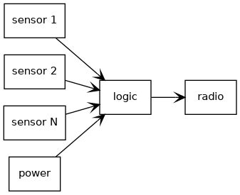
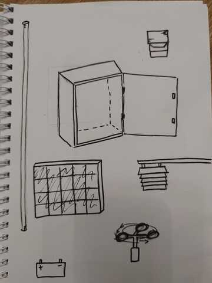

# 1. Principles and practices

## Too many interesting projects on my mind...
...I would say weather station is most interesting, but also it is very challenging if amount of used sensors are very many. However, you can start with simple one first and add more later.

Here comes short specs for each of those.

### Outdoor weather station
Design and manufacture feature rich outdoor weather station. More sensors the better. Operating power could be taken from solar panels or wind turbine if electricity is not available. Communication by some wireless method, WiFi, LoRa, etc.

* Temperature
* Humidity
* Atmospheric pressure
* Wind speed
* Rainfall
* Seismometer
* Fog meter

A lot of commercial solutions exits and most of those professional models are even very expensive (Vaisala, etc.).

<figure markdown>
  { width="200" }
  { width="200" }
  <figcaption>Pictures by Kaisa, thanks!</figcaption>
</figure>

### Magic mirror
Manufacture mirror that shows some live information, like weather forecast or room temperature. Technically it is computers screen which is covered by mirror glass than can be seen through - semi-transparent mirror. Computer drives the screen behind the mirror and does all the needed logic. Possible sensor used is for example motion sensor which turns on screen when motion is detected.

### Vehicle speed monitor
Display that shows speed of the approaching car or some other object. Use Doppler radar as sensing speed of vehicle and display it on the screen and/or feed data electronically to some other systems. It is similar solutions than existing ones you can see on some places to warn if you are driving over the limits. Needs suitable doppler radar module and possible display and some logic.

