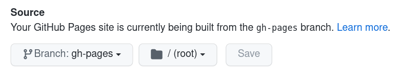
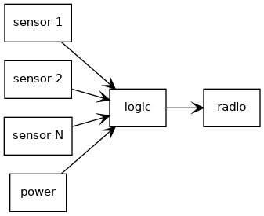

# 2. Project management
## Setup tools
I am using Fedora Linux workstation so many of needed tools were easily available from the distribution package management. Also I have used many of the needed tools earlier so those were already installed.

### Git
```console
sudo dnf install git
```

Tool was already installed. I have used it a lot.

Here is some basic commands I use most often:
```console
git status
git log
git show
git diff
git reset --hard
git add <filename>
git commit -s
git push origin master
```

Status shows general state of your current tree, like edited or new files. Log shows your commit history. Show shows last commit on your tree. Diff shows uncommitted changes what you have made your files. Reset --hard is handy when you have made changes to tree, but you need to discard those for some reason. Add adds file or directory you have edited to your commit you are going to do. Commit does the commit itself. Push uploads your local working tree to GitHub on my chase.

### GitHub
https://github.com/

GitHub was already in use and configured. No need to to anything special. I decided to use it instead of GitLab due to that reason.

For GitHub you need account. After that you need to add your public ssh key to GitHub in order to access using git-command.

### GitHub Pages
https://github.com/

Used to host this WWW-site. It is easy to maintain that document just by pulling tree to GitHub using Git. Pages needed to be enabled from GitHub settings.

Following settings are needed to GitHub Pages to point out location it loads that WWW-site.


### MkDocs
```console
sudo dnf install mkdocs-material
```

First I thought I will maintain static HTML pages by hand. After I looked some videos, recommended MkDocs starts feeling more handy so I decided to give it a try. Also there was Material theme based existing template for the course. Installation was pretty straightforward from the package manager: *sudo dnf install mkdocs-material*. It will install both theme and documentation tool as a dependency. After that I manually copied course template files to my local working Git tree and tested it with command *mkdocs serve*. Worked, pretty simple.

There was some challenges releasing that documentation on GitHub Pages. MkDocs documentation needs to be build in order to get site that can be released on GitHub Pages. It didn't feel very comfortable to commit machine build documentation to my working Git branch as it pollutes branch unintentionally without a reason. Fortunately there was a command *mkdocs gh-deploy* which makes new branch for documentation and publish it automatically.

```console
mkdocs serve
mkdocs gh-deploy
```
Serve launch local development site to your computer. gh-deploy builds site and uploads it to the GitHub Pages.

### Graph-Easy
```console
sudo dnf install perl-Graph-Easy
```

Makes those simple diagrams used.

```console
echo "[sensor 1], [sensor 2], [sensor N] -> [logic] <-> [radio] [power] -> [logic]" | graph-easy --as_dot | dot -Tpng -o weather_station_graph.png
```

Gives you graph:


