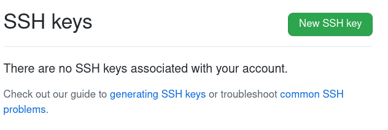
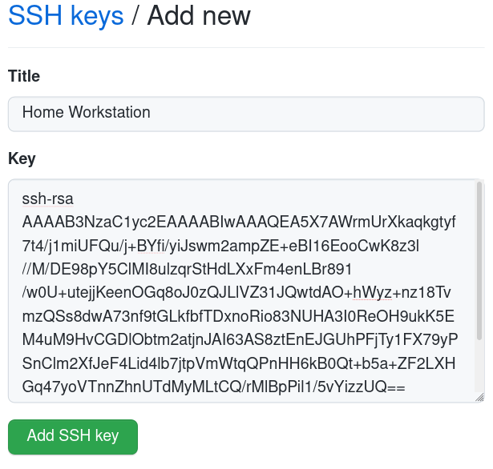
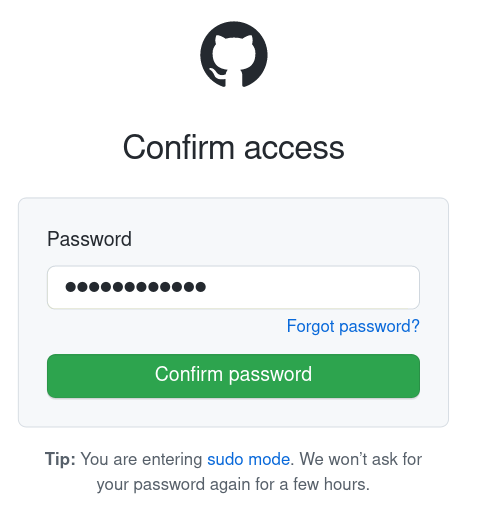
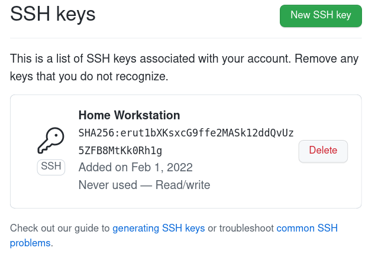

# 2. Project management

> ## Assignment
>
> - Work through a git tutorial
> - Build a personal site in the class archive describing you and your final project

## Setup tools

I am using Fedora Linux workstation so many of needed tools were easily available from the distribution package management. Also I have used many of the needed tools earlier so those were already installed. 

### Git

Git is the most popular distributed version control tool. It does not in itself limit what kind of files are stored there, but it is typically used in software projects. Version control takes place locally on the machine, from where it is then synchronized to the servers. This decentralization model via servers allows multiple people to develop the same code base in parallel at the same time. 

``` console
sudo dnf install git
```

Tool was already installed. I have used it a lot. 

Here is some basic commands I use most often:

``` console
git status
git log
git show
git diff
git reset --hard
git add <filename>
git commit -s
git push origin master
```

Status shows general state of your current tree, like edited or new files. Log shows your commit history. Show shows last commit on your tree. Diff shows uncommitted changes what you have made your files. Reset --hard is handy when you have made changes to tree, but you need to discard those for some reason. Add adds file or directory you have edited to your commit you are going to do. Commit does the commit itself. Push uploads your local working tree to GitHub on my chase. 

### GitHub

[GitHub](https://github.com/) is a very popular server / service for Git repositories - a place on the Internet where you can store and share your own Git repositories. Today, GitHub offers a large number of related services, e.g. bug tracker, documentation and web pages (GitHub Pages). 

GitHub was already in use and configured. No need to to anything special. I decided to use it instead of GitLab due to that reason. 

You need to create a user account for GitHub. In addition, it is often practical, but not necessary if https used, to add ssh keys in addition to the password, so you don't have to enter the password every time you update the repository on GitHub. 

#### GitHub SSH keys

Here is yet another documentation required by documentation how to add ssh keys to GitHub. 

On GitHub web user interface, go to your account settings. Settings => SSh and GPG keys. Push green button "New SSH key". 

||
||
|Add SSH key|

Give some name you like to key, I used "Home Workstation". 

Then you need to find your personal PUBLIC key. Here is how it is found from Linux workstation - assuming you have already generated it. Copy & paste that ssh key (do not paste this unique key, it is my public key, you need your own) to GitHub as seen on picture below. I already had ssh keys because I usually use them in many places. ssh keys can be generated with the ssh-keygen command, for example. 

``` console
cat ~/.ssh/id_rsa.pub 
ssh-rsa AAAAB3NzaC1yc2EAAAABIwAAAQEA5X7AWrmUrXkaqkgtyf7t4/j1miUFQu/j+BYfi/yiJswm2ampZE+eBI16EooCwK8z3l//M/DE98pY5ClMI8ulzqrStHdLXxFm4enLBr891/w0U+utejjKeenOGq8oJ0zQJLlVZ31JQwtdAO+hWyz+nz18TvmzQSs8dwA73nf9tGLkfbfTDxnoRio83NUHA3I0ReOH9ukK5EM4uM9HvCGDlObtm2atjnJAI63AS8ztEnEJGUhPFjTy1FX79yPSnClm2XfJeF4Lid4lb7jtpVmWtqQPnHH6kB0Qt+b5a+ZF2LXHGq47yoVTnnZhnUTdMyMLtCQ/rMlBpPil1/5vYizzUQ== crope@localhost.localdomain
```

||
||
|Add new SSH key|

As you are going to add new login method / key to your existing GitHub account it will ask your password as confirmation. 

||
||
|Confirm SSH key|

If everything went correctly added key should appear to list of ssh keys at your GitHub account. 

||
||
|SSH key added|

### GitHub Pages

[GitHub Pages](https://pages.github.com/) is a GitHub-related website publishing platform. The website is uploaded to the GitHub repository from where it is automatically updated to the GitHub Pages. The GitHub Pages feature must be turned on in the GitHub settings. 

I generate a site to publish to GitHub Pages on my own machine and publish it with the mkdocs gh-deploy command. 

Following settings are needed to GitHub Pages to point out location it loads that website. 

||
||
|GitHub Pages|

### MkDocs

First I thought I will maintain static HTML pages by hand. After I looked some videos, recommended MkDocs starts feeling more handy so I decided to give it a try. Also there was Material theme based existing template for the course. Installation was pretty straightforward from the package manager: *sudo dnf install mkdocs-material*. It will install both theme and documentation tool as a dependency. After that I manually copied course template files to my local working Git tree and tested it with command *mkdocs serve*. Worked, pretty simple. 

``` console
sudo dnf install mkdocs-material
```

There was some challenges releasing that documentation on GitHub Pages. MkDocs documentation needs to be build in order to get site that can be released on GitHub Pages. It didn't feel very comfortable to commit machine build documentation to my working Git branch as it pollutes branch unintentionally without a reason. Fortunately there was a command *mkdocs gh-deploy* which makes new branch for documentation and publish it automatically.

``` console
mkdocs serve
mkdocs gh-deploy
```

Serve launch local development site to your computer. gh-deploy builds site and uploads it to the GitHub Pages. 

## Git / GitHub process

I created a simple MkDocs Material page for GitHub for testing purposes and to test the operation of the tools. 

In addition to the tools already mentioned, you need the github gh tool to control GitHub from the command line. 

``` console
sudo dnf install gh
```

``` console
$ mkdocs new .
INFO    -  Writing config file: ./mkdocs.yml 
INFO    -  Writing initial docs: ./docs/index.md 
$ echo "theme:" >> mkdocs.yml 
$ echo "  name: material" >> mkdocs.yml 
$ git init -b master
Initialized empty Git repository in /home/crope/fablab/tmp/.git/
$ git add .
$ git commit -m "initial commit"
[master (root-commit) 63bc513] initial commit
 2 files changed, 21 insertions(+)
 create mode 100644 docs/index.md
 create mode 100644 mkdocs.yml
$ gh repo create fablab_test --push --public --source ./
✓ Created repository palosaari/fablab_test on GitHub
✓ Added remote git@github.com:palosaari/fablab_test.git
✓ Pushed commits to git@github.com:palosaari/fablab_test.git
$ mkdir docs/assignments
$ echo "# 1. Hello World"  > docs/assignments/week01.md
$ git add .
$ git commit -m "add week 1"
[master 6cb5515] add week 1
 1 file changed, 1 insertion(+)
 create mode 100644 docs/assignments/week01.md
$ git status
On branch master
Your branch is ahead of 'origin/master' by 1 commit.
  (use "git push" to publish your local commits)

nothing to commit, working tree clean
$ git push 
Enumerating objects: 7, done.
Counting objects: 100% (7/7), done.
Delta compression using up to 8 threads
Compressing objects: 100% (3/3), done.
Writing objects: 100% (5/5), 420 bytes | 420.00 KiB/s, done.
Total 5 (delta 0), reused 4 (delta 0), pack-reused 0
To github.com:palosaari/fablab_test.git
   d872937..6cb5515  master -> master
$ git reset --hard HEAD~1
HEAD is now at d872937 initial commit
$ git fetch 
$ git status
On branch master
Your branch is behind 'origin/master' by 1 commit, and can be fast-forwarded.
  (use "git pull" to update your local branch)

nothing to commit, working tree clean
$ git pull
Updating d872937..6cb5515
Fast-forward
 docs/assignments/week01.md | 1 +
 1 file changed, 1 insertion(+)
 create mode 100644 docs/assignments/week01.md
$ git status
On branch master
Your branch is up to date with 'origin/master'.

nothing to commit, working tree clean
$ gh repo delete fablab_test
? Type palosaari/fablab_test to confirm deletion: palosaari/fablab_test
✓ Deleted repository palosaari/fablab_test
$ 
```

|Command|Explanation|
|||
|mkdocs new .|Create new MkDocs site|
|echo "theme:" >> mkdocs.yml|Use Material theme for MkDocs|
|echo "  name: material" >> mkdocs.yml|Use Material theme for MkDocs|
|git init -b master|Create Git repository|
|git add .|Add all files in current directory to commit set|
|git commit -m "initial commit"|Commit changes to local repository|
|gh repo create fablab_test --push --public --source ./|Create GitHub repository and push local repository to GitHub|
|mkdir docs/assignments|Create directory for MkDocs web-page|
|echo "# 1. Hello World"  > docs/assignments/week01.md|Add Hello World MkDocs web-page|
|git add .|Add docs/assignments/week01.md to commit set|
|git commit -m "add week 1"|Commit changes to local repository|
|git status|Check git repository status. It says it has one commit more than remote repository.|
|git push|Synch changes from local to remote repository.|
|git reset --hard HEAD~1|Remove most recent commit from local repository|
|git fetch|Download changes from remote repository.|
|git status|Check git repository status. It says local has one commit less than remote repository.|
|git pull|Add changes from remote to local repository.|
|git status|It says local repository is same than remote.|
|gh repo delete fablab_test|Delete test GitHub repository|

## Creating website

MkDocs is the web page generation tool I use. Its operation is based on the generation of static web pages from code written in Markdown markup language. Markdown, on the other hand, is a very simple language in syntax. A document written with Markdown is easy to read and write with just a text editor. MkDocs converts documents written with Markdown to html format, which is used on web pages. 

I had no previous experience with MkDocs, so it felt easy to try the Fab Academy template provided. The template was simple, including in practically a blank page for each week. After learning the basics I removed all the extra weeks as I will add them as I do them. MkDocs uses a directory structure to specify the layout of a site. You can see that in this case as **./docs/assignments/** directory forms a section on your site called **Assignments**. All the public documentation files must go under **./docs/** directory, root **./** has only configuration file. Site public pages must have a .md file extension, which is then converted to html by MkDocs. 

The directory structure of the site looks like this. 

```
.
├── docs
│   ├── assignments
│   │   ├── week01.md
│   │   └── week02.md
│   ├── images
│   │   ├── week01
│   │   │   ├── directory
│   │   │   │   └── file.img
│   │   │   └── file.img
│   │   └── week02
│   │       └── file.img
│   └── index.md
└── mkdocs.yml
```

The configuration file **mkdocs.yml** had a lot of settings and add-ons that I didn't need, so I generated a new configuration file with the **mkdocs new** command. The only extension I used was **markdown_extensions: extra** because I used the html tag it provides for the image caption tag. I deleted it later because I started using tables to add images and caption. I try to avoid adding anything extra, staying as default MkDocs as possible if there is no compelling need. 

The configuration file is so simple. You can add a lot of stuff there if needed. I’ll probably add some css style or something to change the background color of the tables from gray to white. 

```
site_name: Fab Lab Oulu Student Blog

theme:
    name: material
```

I test pages written with Markdown locally on the machine using the mkdocs serve command. I save the changes to the local git and from there upload them to the GitHub Pages service with the **mkdocs gh-deploy** command and the **git push** command to the GitHub remote repository. 

So all-in-all, whole toolchain behind the site is:

- [MkDocs](https://www.mkdocs.org/)
- [Material for MkDocs](https://squidfunk.github.io/mkdocs-material/)
- [Git](https://git-scm.com/)
- [GitHub](https://github.com/)
- [GitHub Pages](https://pages.github.com/)

