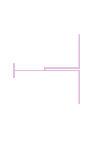

# 3. Computer-Aided Design

> ## Assignment
>
> - Evaluate and **select** your 2D and 3D software. I recommend Inkscape, GIMP and Fusion 360.
> - Demonstrate and describe **your own** processes used in modelling with 2D and 3D software eg. 2D raster, 2D vector and 3D modelling processes.
> - Model (raster, vector, 2D, 3D, render, animate, simulate, ...) a possible final project, compress your images and videos, and post it on your class page.
> - Include your design files as **original and common** formats (jpg, dwg, stl).

This week task was to study and evaluate different design tools - raster, vector, 2D and 3D. My personal needs are mostly 3D design so I did more testing and evaluation on that side. Selected design tools are: GIMP, Inkscape and FreeCAD. 

## GIMP

Basic picture editing tool selected was simply GIMP (GNU Image Manipulation Program). I have used it earlier, it comes with Linux distribution used and it does the job. I think I don't even need it much during these courses. 

GIMP is a program for processing pixel / raster images. Images in this format are saved as 2-dimensional array of pixels in the file. Typically, images displayed in pixel format are images like a photos with a lot of details. Scaling images in this format is a bit problematic, especially when it is enlarged by duplicating the pixels, which makes the image looking softer, for example, 4x magnification creates 4 new pixels by cloning single original pixel. 

I drew a simple picture in a test sense. I started the app, added a new drawing (File->New...). I selected the drawing tool "Tools->Paint Tools->Pencil", then resized the pen from the menu on the left (Size: 20). I used the mouse to draw the image below. I wanted to try a transparent background so I added an Alpha channel (Layer->Transparency->Add Alpha Channel). I selected a white background that I wanted to make transparent with the "Select->By Color" tool and pressed the "Del" button to remove it. After that, the background became transparent. Finally, I saved the file. 

||
||
|GIMP|

``` console
sudo dnf install gimp
```

||
||
|"Hello GIMP", which I drew. The background is transparent, so it shows the color of the cell.|

### Popular raster/pixel image formats

Some of the very popular raster / pixel image formats are JPEG, GIF, PNG and TIFF. 

**GIF** and **PNG** are pretty similar, PNG is kind of an improved version of GIF. The biggest practical technical differences between these are transparency and support for animations. PNG, unlike GIF, supports the so-called Alpha channel, which can be used to define transparency. GIF, on the other hand, supports animations that are not supported in PNG. Both are lossless formats, unlike JPEG. 

**JPEG** is the most popular "photo" format. It uses lossy compression to achieve a small image file size, but the downside is the data lost from the image. Due to the compression method, it is well suited for applications where the image is viewed with the human eye, as the human eye does not distinguish small removed details. For technical use, for example for drawings with lines, it is often not very useful due to the lossy packaging. 

**TIFF** is a lossless format. It is widely used in the processing of raw photographs. The format can be considered as a format for image processing professionals. TIFF files are often really large, so they are not used to display images on web pages, for example, but are converted to a lossy JPEG format before publication. 

**XCF** is the native file format used by GIMP. It's not a very interchangeable format, but it's a good idea to stick to this format when using GIMP. GIMP can export an image in many formats, so you can transfer it to other programs when necessary. 

## Inkscape

Inkscape is a vector graphics editor I selected. It was natural choice as it was available from my OS package manager and it is rather feature rich. I am not sure how much I will need that kind of 2D vector graphic design tool still - probably for the laser cutter at least. 

Vector graphics are a way of modeling an image in which the image is treated as lines, or mathematically called vectors. For example, a square can be expressed as 4 lines with length, direction, and coordinates. Thus, expressed as vectors, an image can be scaled indefinitely without sacrificing its accuracy. Vector graphics are well suited for mechanical drawings with a lot of straight edges and geometry, but are not suitable for displaying irregular images such as photographs. Because of these geometric properties, the format is widely used as a file format for various computer-controlled cutters. 

As a test, I quickly draw simple half wave dipole antenna around 1000 MHz (not simulated not even calculated accurate, just a concept). I wonder if it is possible to laser cut that kind of small antennas from few millimeter thick aluminum plate... 

I drew the image of the antenna with the "Create rectangles and squares" tool from many pieces. I defined the dimensions and coordinates (W / H / Rx / Ry) of each piece separately by hand on a millimeter scale. The pieces should have been joined / grouped with some other tools, but I couldn't do it, so they're kind of separate at the moment. I think if the design is tried to cut with some tool it will probably cut all the pieces apart using the border lines. 

||
||
|Inkscape|

``` console
sudo dnf install inkscape
```

||
||
|Dipole antenna in SVG format|

### Popular vector image formats

There are quite a few vector graphics file formats, many of which are formats related to a specific computer program. Some of the most common formats are SVG, EPS and AI. 

**SVG** is an open format developed by the W3C (World Wide Web Consortium). The format is really common and widely supported, very interchangeable. The format is also supported in browsers directly. Inkscape native format. 

**EPS** stands for Encapsulated PostScript. I don't know the format in more detail, and I probably won't use it if there is no special need. Inkscape supports the format, but Firefox didn't seem to know it. 

**AI** is a file format used by Adobe. It is a very popular format because Adobe programs are popular with image processing professionals. Inkscape can't save in AI format so I'm probably not going to use it. 

## FreeCAD

3D design tool is one I likely need most. Here I evaluated Fusion 360 and FreeCAD. I had too much problems with Fusion 360. Firstly, Fusion 360 does not have Linux version and secondly that mess about user account. I tried it with Wine (Windows API implementation for Linux) but not very great results. It worked somehow, but feeling was a bit buggy. Also registration for Autodesk in order to get license was a bit tricky and you have to send some proofs (like picture of student id) in order to get education license. And for some reason it still started 30 days trial version of Fusion 360 even "You’re eligible for free one-year educational access to Autodesk products through the Autodesk Education Community.". 

So I eventually switched to FreeCAD. My only earlier experience of 3D modeling I had was some experience modelling antennas using CST Studio. FreeCAD feels totally different which means learning curve will be rather heavy. After looking some tutorials from YouTube I was finally able to made simple design. It wasn't any part for my final project, but something useful still - it is cover plate for light switch. I need that as I have replaced manual light switches with smart ones that are controlled via home automation. 

3D design made was build from 4 different blocks. All blocks were first drawn as 2D sketch (FreeCAD Sketcher workbench) and then converted to 3D model. First block was "Pad" which covers outlines of whole part. Then rest of three blocks were "Pocket" which are then removed from the Pad by boolean style operation. For each 2D sketch, I defined shapes with constrains - corner roundings, border lengths and symmetry around the origin. 

||
||
|FreeCAD|

||
||
|FreeCAD Sketcher Workbench, 2D drawing|

``` console
sudo dnf install freecad
```

### FreeCAD file formats

**FCStd** is a native file format for FreeCAD. It makes sense to stay in this format as long as you make design with the program. The format is not very compatible with other programs. When making a product from the 3D model, the drawings must be transferred to a format suitable for the manufacturing tool. When cutting parts of a 3D model, you typically want to convert the model to some 2D vector format, like SVG. When printing a design with a 3D printer, the model must be converted to one of the printable 3D formats, which is very often STL. 

FreeCAD supports a wide variety of [file formats](https://wiki.freecadweb.org/Import_Export). 

## Files

- [hello_gimp.xcf](../images/week03/hello_gimp.xcf)
- [hello_gimp.png](../images/week03/hello_gimp.png)
- [dipole antenna.svg](../images/week03/dipole antenna.svg)
- [ABB Cover frame Jussi Impressivo.FCStd](../images/week03/ABB Cover frame Jussi Impressivo.FCStd)
- [ABB Cover frame Jussi Impressivo.stl](../images/week03/ABB Cover frame Jussi Impressivo.stl)

