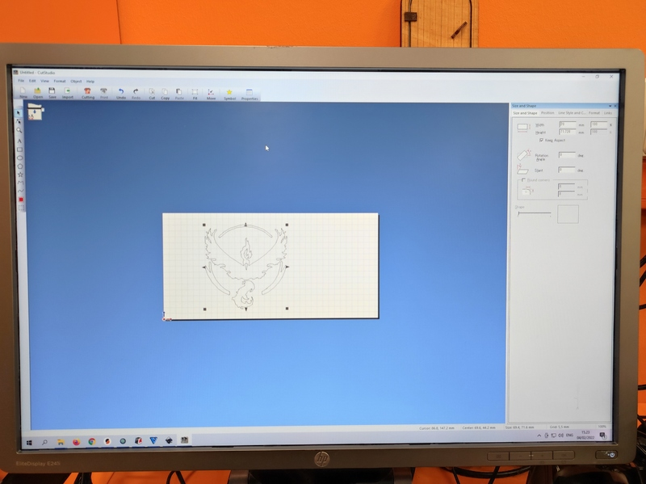

# 4. Computer controlled cutting

## Weekly task

This week went training with vinyl cutter and laser cutter and related design software. We started studying vinyl cutter basics and after that did the same with laser cutter. Most of the time went still learning laser cutting as that process is more complex starting from the 3D-modelling process.

## Vinyl cutting

Vinyl cutter is a printer look-a-like machine that has a small knife in order to cut rather thin and soft material. Typically that material is just vinyl tape which is cut to some stickers.

Used vinyl cutter was Roland CAMM-1 GS-24 and it is controlled by Windows workstation.

||
||
|Roland CAMM-1 GS-24 vinyl cutter|

Usually cutter is connected to computer like a printer using printer driver made for the device. So instead of printing, it will cut. Printed document needs to be converted into vector format. Line width didn't seem to have any requirement at our test, it just cuts where the line of the center line was. Anyhow, printer driver API is for printers and does not fit 100% well with other use cases like that, so be warned there may be device vendor specific tricks which are varying from manufacturer to other and so.

### Sticker

As a vinyl cutting exercise I made some Pokemon Go Team Valor logo stickers. I downloaded suitable existing logo which was a red colored raster image on transparent background in .png format. Then I used Inkscape Trace Bitmap tool to the logo in order to get vector image with borders. Vector image was then cut by using vinyl cutter.

Here is the original image of the used [Valor logo](https://www.seekpng.com/ima/u2q8u2i1t4u2q8t4/)

||
||
|Valor stickers|

||
||
|Valor sticker installation I made on workroom door|


"Edge detection" method ended up with unwanted results because it made double line borders. I think it could be caused by the smooth borders of the original photo. First I removed those duplicate lines manually, which was pretty much work. I eventually decided to test other trace algorithms as Inkscape supports very many of them - 5 for single scan and 4 for multiple scans. I found that "Edge detection" and "Autotrace" methods make pretty good looking traces for my logo image. I used default parameters for both of those tracing algorithms and finally vinyl cut few pieces of logos for each used tracing algorithm. There was not big difference in the result between both algorithms.

* Cutter; Turn power on
* Cutter; Open vinyl load lever, located back left
* Cutter; Insert large enough piece of vinyl
* Cutter; Close vinyl load lever, located back left
* Cutter; Set left and right rollers. Those need to be on white markings. Roller locations are used to detect material width.
* Cutter; Select "PIECE" from "SELECT SHEET" cutter menu. There is some other material options available too like "ROLL", but for small cutting "PIECE" is enough. Piece means small piece of material, cutter measures height automatically and width is taken automatically from roller locations.
* Inkscape; Open your vector design file
* Inkscape; Open "Extensions -> Roland CutStudio". This extension is installed on our fab lab workstation. It opens CutStudio with your design from Inkscape.
* CutStudio; File -> Cutting Setup... Get sheet size from the cutter "Get From machine". It should show same size you can see on vinyl cutter screen
* CutStudio; Scale your drawing to fit vinyl sheet size and set drawing position on sheet. Also you could for example clone it or do other tricks needed before cutting.
* CutStudio; File -> Cutting... in order to physical cut operation.

After cutting is finished vinyl can be removed from the cutter. Firstly it is better to move cutting head to parking position from the cutter setting in order to get more room to work. Then release load lever and remove vinyl. It should then manually remove those unneeded parts from the vinyl and for that job you may need scissors, needle or tweezers, especially if cutting contains very small vinyl parts. After all the unneeded parts are removed you need to add adhesive transfer sheet in order to place vinyl sticker to final position.

||
||
|Select sheet type|

||
||
|Sheet size detected by the cutter with PIECE setting|

||
||
|Get sheet size from cutter|

||
||
|Inkscape launch CutStudio|

||
||
|Roland CutStudio|

||
||
|Peeling vinyl tape|


## Laser cutting

### Kerf

Kerf is term for "extra" material removed by the cutting process itself. On ideal case cutting process does nothing but cuts your material as desired, but in real life there is very often mechanical or some other process that removes material. That is for example saw blade or laser beam. So if your saw blade is 1mm wide it will remove that much material and it is said that 1mm kerf is removed. Same applies for laser beam too as it burns material during cutting process. Kerf should be taken into account when that small amounts of extra removed material is essential.

#### Kerf test for Acrylic 3mm

I ran test for 3mm Acrylic plate. I got two different results depending how I ordered those 10 small pieces. Laser beam cut/kerf is not constant - it is wider on top side and a little bit smaller on bottom side. Larger calculated kerf is gotten when every other piece is upside-down and it is about double the size of compared to another. Larger kerf value, 0.136mm, seems to be more realistic in real life in that case.

```
>> (100-99.45)/10
ans =  0.055000
>> (100-98.64)/10
ans =  0.13600
```

||
||
|Kerf 0.055mm|

||
||
|Kerf 0.136mm|

### Focus test

Some tests were made how focus effects to cutting. +/-2mm and +/-4mm offsets were tested to plywood. Laser is usually calibrated so that most of the power is on focus. Due to that, the more the material is off from the focus the less the power it gets. 4mm offset with used settings caused it does not cut through anymore on one test.

||
||
|Focus test|

### Power, frequency, speed tests

Then we tested how different laser parameters effects to cut and engrave. All these 3 parameters have some relation to operation result. If you for example decrease power you can/should also decrease speed in order to succeed the same thickness in the material cut.

Test plate shows how increased speed eventually fails cut. On test plate you can see the same happens for decreased power too.

||
||
|Power, frequency, speed tests|

### DPI test

Laser DPI test was made for 150, 300 and 600 DPI resolutions. Result is that 150DPI burns less material and 600DPI the most, which is expected. It is because bigger the resolution the more there is overlapping burned points by laser beam. As we calculated Kerf, for 3mm vinyl, upper side, it was 0.136mm. So lets assume that this is beam width and it is same for MDF (~rough estimate). DPI is shorthand for Dots Per Inch. Inch is 2.54cm => 25.4mm.
```
>> 2.54*10/0.136
ans =  186.76
>> 600/186.76
ans =  3.2127
```
So calculating maximum DPI from that kerf value we got 186.76 DPI. And in all points after that gets lasered multiple times / overlapping and due to that burns more material. 600DPI means every single point is burned roughly 3.2 times (hope calculations about are correct).


||
||
|DPI test|

### 3D model of simple block

I used FreeCAD to design simple brick having 4 joints, one for each side. I saw this kind of pieces on lab so I decided to go where it was easiest. First I made 2D sketch on FreeCAD. Then I drew outline of part using **polyline** tool on **sketcher** [toolbar or Sketch -> Sketcher geometries -> Create polyline]. After that I added constraint for horizontal and vertical lines and then symmetry around center point of XY-plane. Then I added equal length constraint of all similar length lines. And finally parametrized that slot width.

||
||
|FreeCAD Sketcher|

Spreadsheet is created for the kerf and material thickness parameters. It may be a bit overkill for this small design but parametric design principles were required so here it is in all flavors.

Technically, that FreeCAD spreadsheet contains formula slotwidth = thickness - kerf, which can be seen on picture. Parameter 'slotwidth' from spreadsheet is used on sketch to define slot width for one slot. Other 3 slots on the sketch are set same size as constraint so same value propagates that way to all slots on design.

||
||
|FreeCAD Spreadsheet|

||
||
|FreeCAD parametric design|


It was somehow difficult to export sketch or 3D model outlines as vector format needed for laser cutter. On ideal case you just need to save/export it in some format and that's all - but it is far from that. The way I did it was that I made FreeCAD TehcnicalDrawing from part and exported it as a .svg (small button on bar, hardly visible on attached picture). After that you can edit it on Inkscape, change line width to 0.02mm required by laser (if line width is too large laser refuses and does error beep). From Inkscape save drawing as a .pdf and use laser printer workstation to print it.

I still wonder if there could be a better tool chain to do all these tasks a bit more automatically.

||
||
|FreeCAD TechDraw|


||
||
|FreeCAD 3D model|


#### Download design:

* [block.FCStd](../images/week04/block.FCStd)
* [block.stl](../images/week04/block.stl)
* [block.pdf](../images/week04/block.pdf)

### Laser cutting

Laser used was Epilog Fusion M2 40.

3D model from FreeCAD was imported to laser using following steps:

* Design workstation; Export FreeCAD Technical Drawing to vector format .svg
* Design workstation; Import .svg to Inkscape
* Design workstation; Edit line width to 0.02mm and check outlines
* Design workstation; Save as .pdf
* Laser cutter; turn on (air intake on, air outlet on, laser power on)
* Laser workstation; Open .pdf
* Laser workstation; Select printer and edit printer (laser) settings
* Laser workstation; Load correct laser settings per material used (you should not need to define your own settings as there is existing settings for most common materials)
* Laser workstation; Send printer work to laser
* Laser cutter; JOG. Interface for positioning laser head to given point, for example setting starting point for your laser cut (top-left corner). There is red laser pointer showing exact point, use joystick to adjust.
* Laser cutter; FOCUS. Interface for moving laser cutter bed up and down. Used for adjusting distance between laser beam and material, there is mechanical triangle tool on laser for setting correct distance.
* Laser cutter; JOB. That's is printing document queue received by the laser machine. Select your job - it is likely the last one.
* Laser cutter; GO. Start cutting.
* Laser cutter; Wait 1 minute or so after laser is finished before opening the lid. That's in order to get all burning products like dangerous smoke to get removed from the machine.

Unfortunately there is very many things you can do wrong. One must be very careful with safety issues when working with laser cutter. Always do the basic checks mentioned on many places near laser (air intake, air outlet) and check the material compatibility. Check where the fire blanket is and make a plan in your head what you would do if it starts burning before you start cutting.

Laser cut blocks in random configuration. If something useful is needed then these blocks can be reconfigured as a kettle base :-)

||
||
|Set of Blocks...|


## Design files
* [Valor logo autotrace.svg](../images/week04/autotrace.svg)
* [Valor logo brightness_cutoff.svg](../images/week04/brightness_cutoff.svg)
* [block.FCStd](../images/week04/block.FCStd)
* [block.stl](../images/week04/block.stl)
* [block.pdf](../images/week04/block.pdf)

## Summary
TOO MUCH WORK. This week was terrible amount of things. Something should be reduced. I would reduce the documentation and focus more on learning.
