# 6. Electronics production

> ## Assignment
>
> ### Individual assignment
>
> - make an [in-circuit programmer](http://academy.cba.mit.edu/classes/embedded_programming/index.html#programmers) by milling and stuffing the PCB
> - [https://gitlab.fabcloud.org/pub/programmers/programmer-swd-d11c](https://gitlab.fabcloud.org/pub/programmers/programmer-swd-d11c)
> - [https://gitlab.fabcloud.org/pub/programmers/programmer-updi-d11c](https://gitlab.fabcloud.org/pub/programmers/programmer-updi-d11c)
> - test it, then optionally try other PCB processes
>
> ### Group assignment
>
> - characterize the design rules for your PCB production process
> - [https://mods.cba.mit.edu/](https://mods.cba.mit.edu/)
> - [traces](http://academy.cba.mit.edu/classes/electronics_production/linetest.png)
[interior](http://academy.cba.mit.edu/classes/electronics_production/linetest.interior.png)
[1/64"](http://academy.cba.mit.edu/classes/electronics_production/0156.jpg)
[0.010"](http://academy.cba.mit.edu/classes/electronics_production/010.jpg)
[fiber laser](http://academy.cba.mit.edu/classes/electronics_production/fiber.jpg)


## PCB production with Roland MonoFab SRM-20 milling machine

Roland MonoFab SRM-20 is rather small desktop CNC milling machine. It is a general purpose milling machine which means it is not the best one for the special purposes like PCB milling though. Anyhow, it could do rather nice PCB milling in cases where PCB area is not very large, PCB is single sided and used traces are relatively wide. It is also quite slow compared to milling machines that are made just for the PCB milling.

On the lab I did that "linetest" using Roland MonoFab SRM-20. Toolpath traces were generated with "Mods" tool [https://mods.cba.mit.edu/](https://mods.cba.mit.edu/).

### Toolpath generation mods.cba.mit.edu

[http://academy.cba.mit.edu/classes/electronics_production/linetest.png](http://academy.cba.mit.edu/classes/electronics_production/linetest.png)

[http://academy.cba.mit.edu/classes/electronics_production/linetest.interior.png](http://academy.cba.mit.edu/classes/electronics_production/linetest.interior.png)


|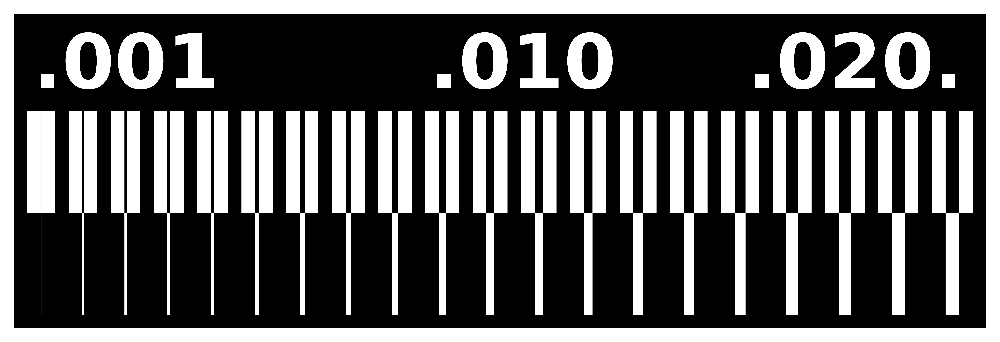|
||
|Fab Academy linetest.png used on this exercise|

||
||
|Fab Academy linetest.interior.png used on this exercise|

Here is step-by-step screenshots how I generated toolpaths for "linetest".

|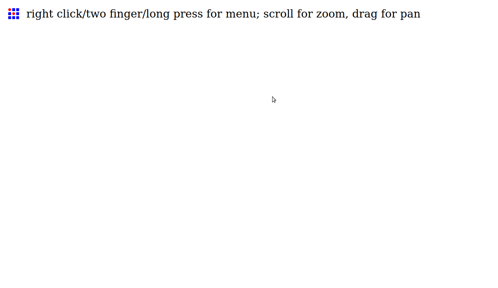|
||
|Empty workbench. https://mods.cba.mit.edu/|

||
||
|Select "programs"|

||
||
|Select "open server program"|

|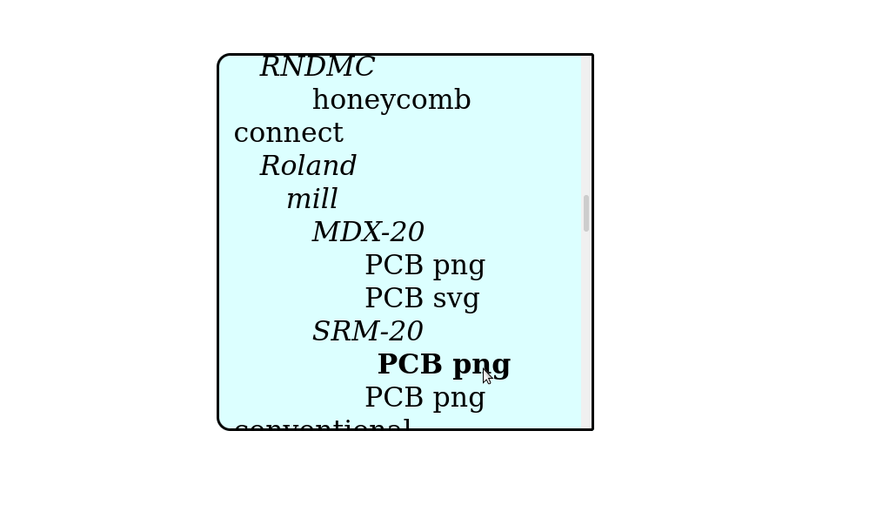|
||
|Select "machines->Roland->mill->SRM-20->PCB png"|

|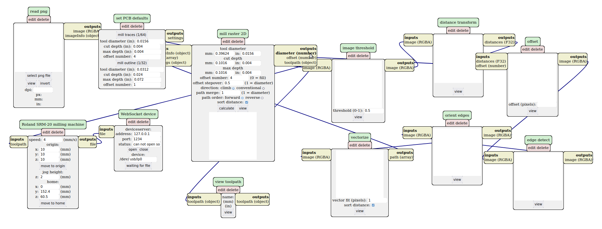|
||
|Milling design tool main view|

|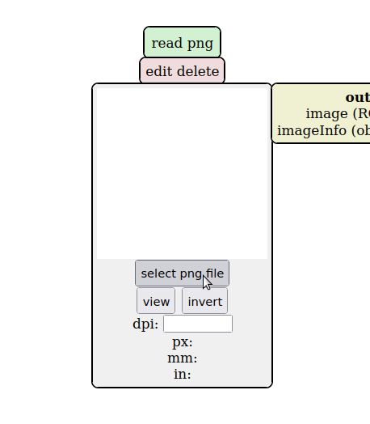|
||
|Select "select png file"|

|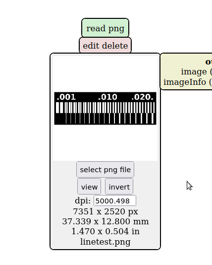|
||
|"linetest.png" file selected from computer|

|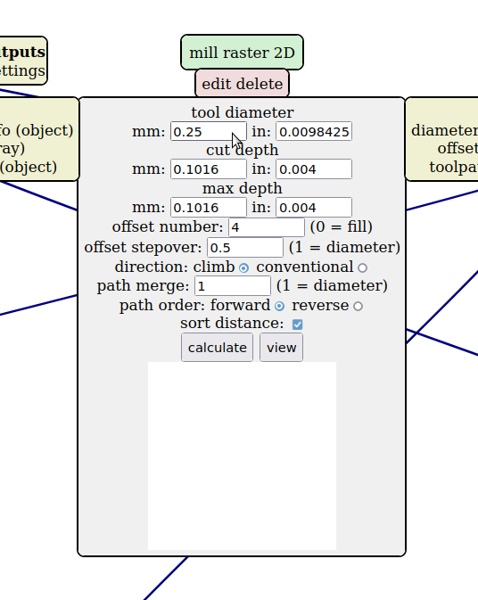|
||
|Set tool diameter to 0.25|

|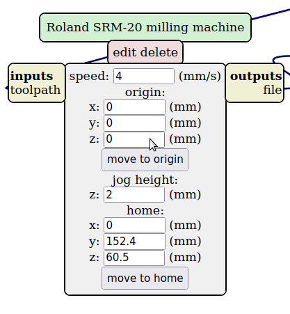|
||
|Change milling machine origin to 0/0/0|

|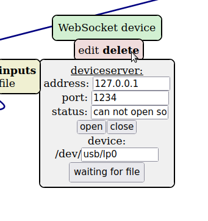|
||
|Select "delete"|

Delete "WebSocket device" module because we don't have network connection on our milling machine. We create "save file" module as a replacement.

||
||
|Select "modules"|

|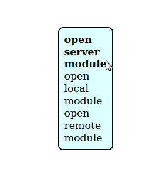|
||
|Select "open server module"|

|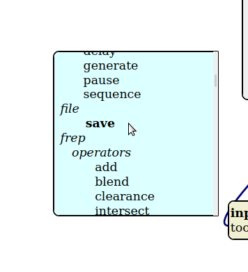|
||
|Select "file->save"|

|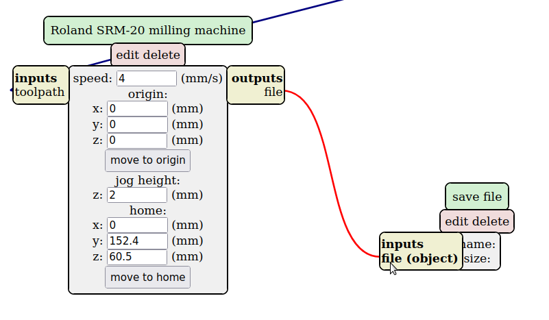|
||
|Add connection between modules. Red line is new connection.|

|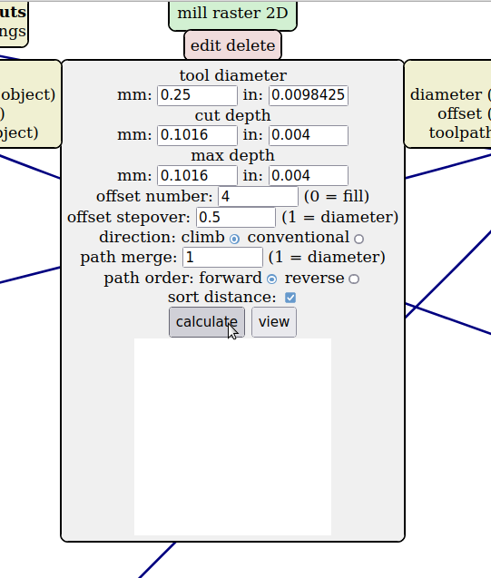|
||
|Select "calculate"|

|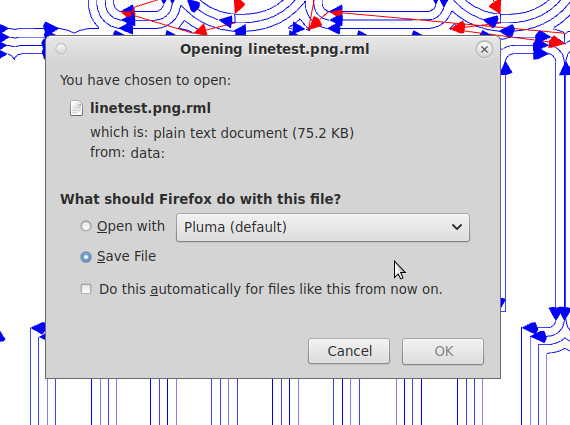|
||
|Save Roland SRM-20 toolpath file for traces|

|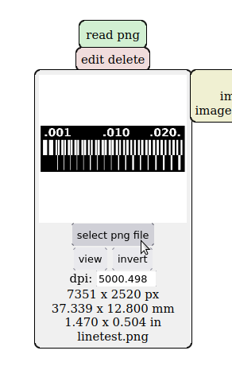|
||
|Select "select png file"|

|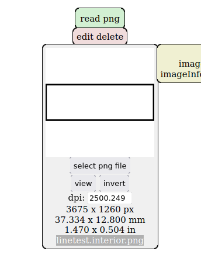|
||
|"linetest.interior.png" file selected from computer|

|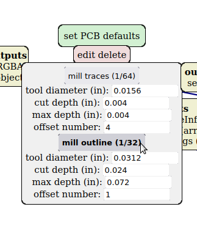|
||
|select "mill outline (1/32)"|

|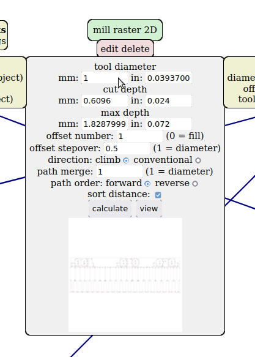|
||
|Set tool diameter to 1|

|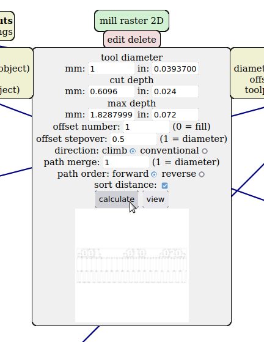|
||
|Select "calculate"|

|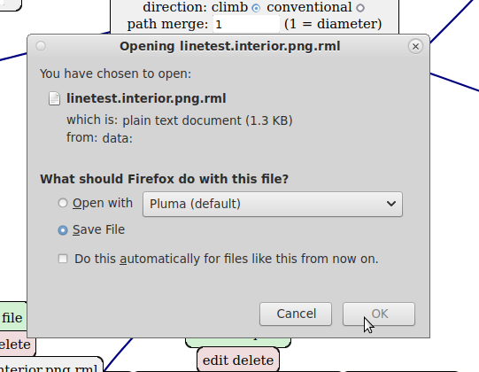|
||
|Save Roland SRM-20 toolpath file for outline|

|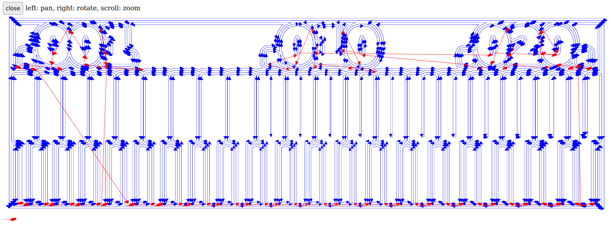|
||
|Generated toolpath for traces (linetest.png)|

|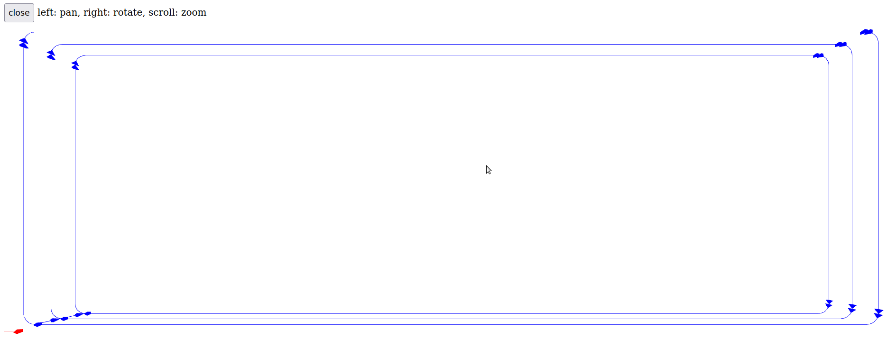|
||
|Generated toolpath for outline (linetest.interior.png)|

### Modules generally needed to touch when using Mods for PCB milling

#### "read png"
Basic input file operations, self explaining?

#### "set PCB defaults"
This module is just to select suitable default values for "mill raster 2D" module. Two choices, one for traces and one for outlines.

#### "mill raster 2D"
This is the most important module. Default settings are pretty good, change if needed. Our lab has for example smaller drill bit for traces than default and larger bit for outlines than default. Change accordingly. Our PCB was FR-1 which is something like 1.6mm substrate and 0.035mm copper or so. Default values fit very well for those PCB thickness, so there is no need to adjust even if those are slightly off.

Our lab re-uses LPKF ProtoMat S62 PCB machine milling bits for SRM-20 PCB milling. Especially tracing drill is different as it is V-shaped 0.2mm-0.5mm drill bit. The bigger the cut depth is, the wider the trace will be. I used 0.25mm value for that bit with all the other settings default, which produces very nice cut.

Offset number setting means how many rounds drill will run in parallel, the bigger the number the larger area is skinned off from the the copper. Different values can be tested and result seen from "view toolpath" module. You may compensate smaller drill by adding more offset, but V-shaped drill bits are not aimed for that so it is better to remove extra copper using more suitable drill bit.

#### "Roland SRM-20 milling machine"
Module for head positioning. Module "origin" should be zeroed as we set origin from machine UI "VPanel for SRM-20" in order to avoid "double" origin. Those defaults are for a situation where SRM-20 is connected and controlled directly by this "Mods" module, but on our case the toolpath is transferred by file.

"jog height" is the value how much drill is lifted above the Z-origin when transferred (not cut) to different position. Default 2mm is OK, I would say do not decrease.

"home" is position where head is moved after the milling job is finished.

#### "save file"
Saves our toolpath to file.

#### "view toolpath"
Open and see how your calculated toolpath looks.


### Milling the PCB

Machine used was Roland MonoFab SRM-20.

Firstly, PCB needs to be attached very well to milling machine bed. PCB has very thin layer of copper which is removed by milling. We are speaking of tolerances about 0.1mm - so attached PCB needs to be very flat! Often PCB is attached to bed using double sided adhesive tape, but we used single side tape for both bed and PCB and used super glue between tapes.

|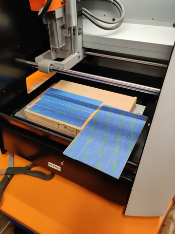|
||
|Bed and PCB taped|

|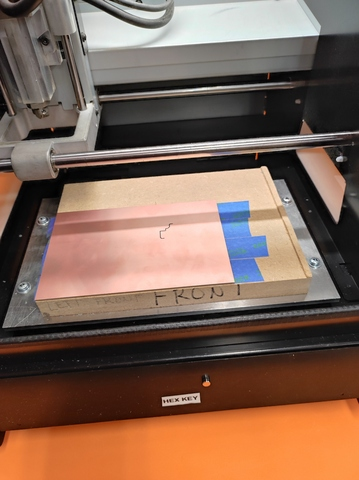|
||
|Bed and PCB glued|

|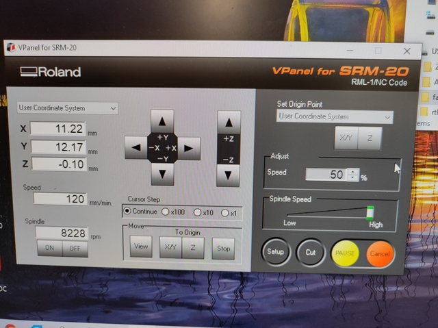|
||
|VPanel for SRM-20 - Roland MonoFab SRM-20 application UI|

I transferred linetest toolpath files to VPanel for SRM-20 application which is ran on normal PC workstation. There is few things to do. I need those 2 drill bits, one for traces and one for outline. Insert traces bit first to SRM-20, be careful, don't drop bit. Then set X/Y-origin and finally set Z-origin. Be very careful when setting Z-origin to avoid crashing bit to PCB. Ran drill bit very near to PCB, then open drill bit lock screw in order to drop drill bit to PCB surface. Tighten lock screw. Set Z-origin to that point using VPanel. Move Z-axis upwards to avoid PCB contact after origin is set. Mill traces. Switch to outer line drill bit similar way than earlier when tracing bit was used. Z-origin needs to be set again similarly than earlier - but do not touch X/Y-origin, it should be remain same that outline milling reach correct location. Mill outline. Remove PCB.

|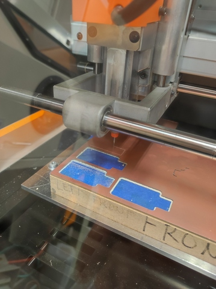|
||
|Milling "linetest" PCB|

I am milling linetest here. Three UPDI or SWD programmer PCBs are already milled as can be seen from those holes on the PCB.

|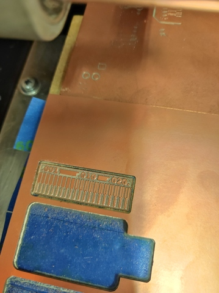|
||
|linetest PCB is milled|

|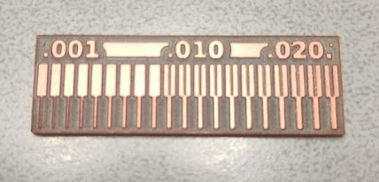|
||
|linetest PCB|

Milled PCB looks pretty nice.

I am not 100% sure how to interpret that, but it looks like scale is in Inches. So 0.010 * 25.4mm = 0.254mm is that smallest slot machine did. It fits to trace drill bit size, 0.25mm, I used in mods when toolpath was made.

## Programmer UPDI D11C

As a exercise I made [Programmer UPDI D11C](https://gitlab.fabcloud.org/pub/programmers/programmer-updi-d11c). We did PCB this time using LPKF ProtoMat S62 PCB milling machine. I had rather much earlier experience from electronics which helps a lot.

|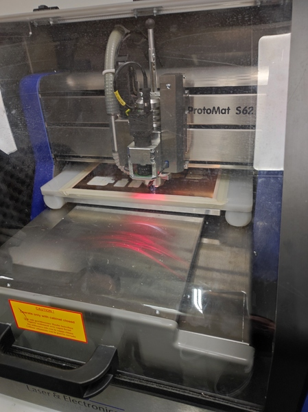|
||
|LPKF ProtoMat S62 PCB milling machine|

|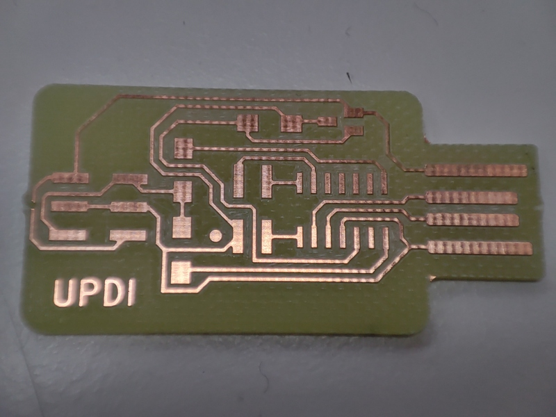|
||
|Programmer UPDI D11C PCB|

|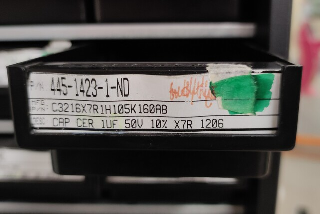|
||
|Capasitor, 1uF|

|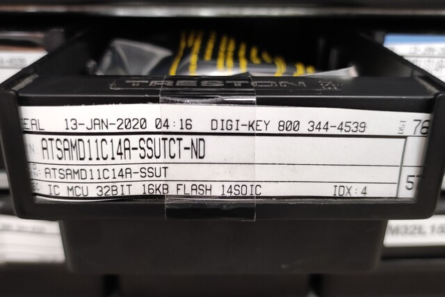|
||
|MCU, Atmel SAM D11|

|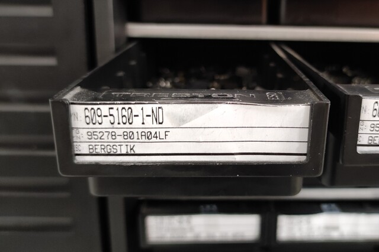|
||
|4-pin header|

|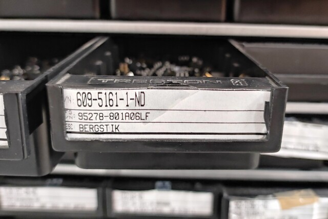|
||
|6-pin header|

|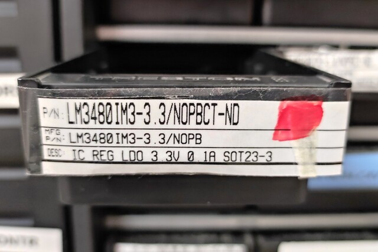|
||
|Voltage regulator, 3.3V|

|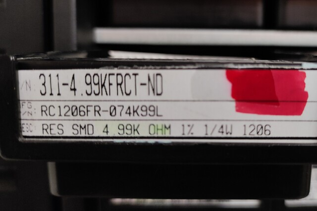|
||
|Resistor 2 pieces, 4.99k ohm|

|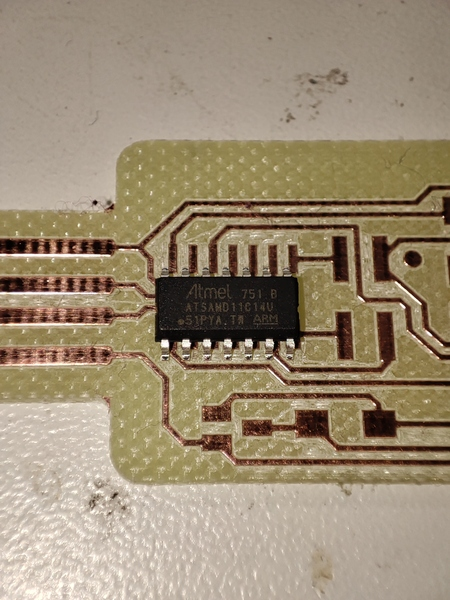|
||
|Atmel SAM D11|

|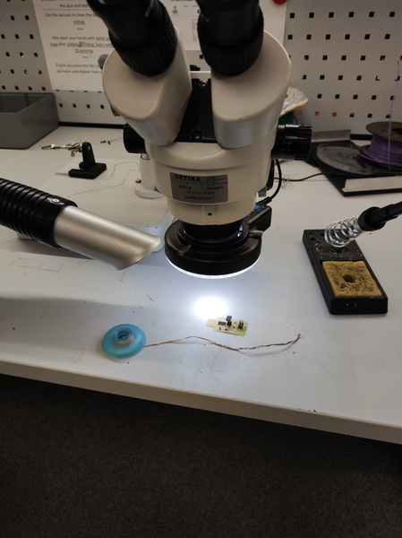|
||
|Soldering|

## UPDI D11C bootloader

Our instructor programmed bootloader to my UPDI board chip using SWD programmer. After bootloader installation chip enumerates to USB bus and my Linux workstation detected it as a USB serial device. 

|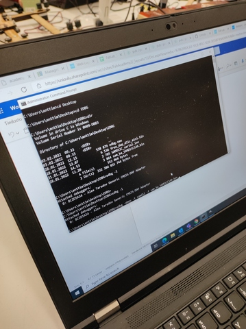|
||
|Flashing bootloader to SAMD11C14|

## UPDI D11C firmware

Finally I programmed chip with [SAMD11C_serial](https://github.com/qbolsee/SAMD11C_serial) firmware using Arduino IDE in order to get it functioning as UPDI serial device. 

### Microchip ATSAMD11C14 support for Arduino

Add additional board manager:

* "File->Preferences"
* "Additional Boards Manager URLS:" (https://raw.githubusercontent.com/qbolsee/ArduinoCore-fab-sam/master/json/package_Fab_SAM_index.json)

Then open Boards Manager and install Fab SAM core for Arduino:

* "Tools->Board->Boards Manager"
* install "Fab SAM core for Arduino"

After that Arduino should have support for ATSAMD11C14 and many other chips from that family. 

### Compiling SAMD11C_serial firmware

I downloaded [SAMD11C_serial.ino](https://github.com/qbolsee/SAMD11C_serial/blob/main/SAMD11C_serial/SAMD11C_serial.ino) and opened it to Arduino.

Select correct environment for that ATSAMD11C14 chip. Instructions from [SAMD11C_serial](https://github.com/qbolsee/SAMD11C_serial).

* "Tools->Board->Fab SAM core for Arduino->Generic D11C14A"
* "Tools->USB config->CDC_only"
* "Tools->Serial config->TWO_UART_NO_WIRE_NO_SPI"
* "Tools->Bootloader Size->4KB_BOOTLOADER"
* "Tools->Port->/dev/ttyACM0 (Generic D11C14A)"
* "Sketch->Compile/Verify"

### Transfer SAMD11C_serial firmware to chip

* "Sketch->Upload"

``` console
Sketch uses 10156 bytes (82%) of program storage space. Maximum is 12288 bytes.
Atmel SMART device 0x10030006 found
Device       : ATSAMD11C14A
Chip ID      : 10030006
Version      : v2.0 Aug 31 2021 14:06:56
Address      : 4096
Pages        : 192
Page Size    : 64 bytes
Total Size   : 12KB
Planes       : 1
Lock Regions : 16
Locked       : none
Security     : false
Boot Flash   : true
BOD          : true
BOR          : true
Erase flash
done in 0.338 seconds

Write 10508 bytes to flash (165 pages)
[==============================] 100% (165/165 pages)
done in 2.908 seconds

Verify 10508 bytes of flash
[==============================] 100% (165/165 pages)
Verify successful
done in 0.481 seconds
CPU reset.
```

## Testing UPDI programmer

For testing build UPDI programmer I need some device to flash. For that I used hello.t412.echo board from lab. I already had Arduino installed on my workstation as I earlier did some esp8266 projects, so I only needed to install ATtiny412 specific development files to Arduino.

hello.t412.echo board is tiny PCB having ATtiny412 chip with two communication interfaces:

* UPDI for programming the chip
* serial for receive and transmit data

Board had initially some slightly tweaked software, its output was in Finnish. I replaced and tested it with the "standard" one.

### Microchip ATtiny412 support for Arduino

I added megaTinyCore using Arduino Boards Manager as descripted in installation instructions: [Installing megaTinyCore](https://github.com/SpenceKonde/megaTinyCore/blob/master/Installation.md)

Add additional board manager:

* "File->Preferences"
* "Additional Boards Manager URLS:" (http://drazzy.com/package_drazzy.com_index.json)

Then open Boards Manager and install megaTinyCore:

* "Tools->Board->Boards Manager"
* install "megaTinyCore"

After that Arduino should have support for ATtiny412 and many other chips from that family.

### Compiling hello.t412.echo.ino test program

I downloaded [hello.t412.echo.ino](http://academy.cba.mit.edu/classes/embedded_programming/t412/hello.t412.echo.ino) and opened it to Arduino.

Select correct environment for that ATtiny412 chip.

* "Tools->Board->megaTinyCore->ATtiny412/402/212/202"
* "Tools->Chip->ATtiny412"
* "Sketch->Compile/Verify"

``` console
Sketch uses 1918 bytes (46%) of program storage space. Maximum is 4096 bytes.
Global variables use 91 bytes (35%) of dynamic memory, leaving 165 bytes for local variables. Maximum is 256 bytes.
```

It compiled correctly.

### Transfer hello.t412.echo program to chip

Connect UPDI, Vcc and GND wires between programmer and device carefully and correctly. Plug UPDI programmer to computer. On my case, Linux, it appears as /dev/ttyACM0 serial device.

[UPDI programmer pinout](https://gitlab.fabcloud.org/pub/programmers/programmer-updi-d11c/-/raw/main/img/pinout.png)

[hello.t412.echo pinout](http://academy.cba.mit.edu/classes/embedded_programming/t412/hello.t412.echo.png)

* "Tools->Port" (/dev/ttyACM0)
* "Tools->Programmer->SerialUPDI - SLOW: 57600 baud, any platform, any voltage, any adapter."
* "Sketch->Upload"

``` console
SerialUPDI
UPDI programming for Arduino using a serial adapter
Based on pymcuprog, with significant modifications
By Quentin Bolsee and Spence Konde
Version 1.2.3 - Jan 2022
Using serial port /dev/ttyACM0 at 57600 baud.
Target: attiny412
Set fuses: ['2:0x02', '6:0x04', '8:0x00']
Action: write
File: /tmp/arduino_build_547357/hello.t412.echo.ino.hex
Pinging device...
Ping response: 1E9223
Setting fuse 0x2=0x2
Writing literal values...
Verifying literal values...
Action took 0.02s
Setting fuse 0x6=0x4
Writing literal values...
Verifying literal values...
Action took 0.02s
Setting fuse 0x8=0x0
Writing literal values...
Verifying literal values...
Action took 0.02s
Finished writing fuses.
Chip/Bulk erase,
Memory type eeprom is conditionally erased (depending upon EESAVE fuse setting)
Memory type flash is always erased
Memory type lockbits is always erased
...
Erased.
Action took 0.01s
Writing from hex file...
Writing flash...
[==================================================] 30/30
Action took 0.65s
Verifying...
[==================================================] 4/4
Verify successful. Data in flash matches data in specified hex-file
Action took 0.42s
```

Chip firmware is uploaded successfully, which is is enough to confirm our UPDI programmer works correctly.

### Test hello.t412.echo board

I think this is out of scope of this week, but here it is briefly.

I used USB serial board to test hello.t412.echo board. Connect TX<->RX and RX<->TX lines between USB serial and hello.t412.echo board. Also connect 5V Vcc and GND from USB serial to hello.t412.echo board. Disable hw flow control from USB serial (not sure if it is needed, I didn't test).

Plug USB cable to computer and open terminal with following settings and test to type some letters.

``` console
$ python -m serial.tools.miniterm /dev/ttyUSB0 115200
--- Miniterm on /dev/ttyUSB0  115200,8,N,1 ---
--- Quit: Ctrl+] | Menu: Ctrl+T | Help: Ctrl+T followed by Ctrl+H ---
hello.t412.echo: you typed "H"
hello.t412.echo: you typed "He"
hello.t412.echo: you typed "Hel"
hello.t412.echo: you typed "Hell"
hello.t412.echo: you typed "Hello"
hello.t412.echo: you typed "Hello "
hello.t412.echo: you typed "Hello F"
hello.t412.echo: you typed "Hello Fa"
hello.t412.echo: you typed "Hello Fab"
hello.t412.echo: you typed "Hello Fab "
hello.t412.echo: you typed "Hello Fab L"
hello.t412.echo: you typed "Hello Fab La"
hello.t412.echo: you typed "Hello Fab Lab"
hello.t412.echo: you typed "Hello Fab Lab "
hello.t412.echo: you typed "Hello Fab Lab O"
hello.t412.echo: you typed "Hello Fab Lab Ou"
hello.t412.echo: you typed "Hello Fab Lab Oul"
hello.t412.echo: you typed "Hello Fab Lab Oulu"

--- exit ---
$ 
```

|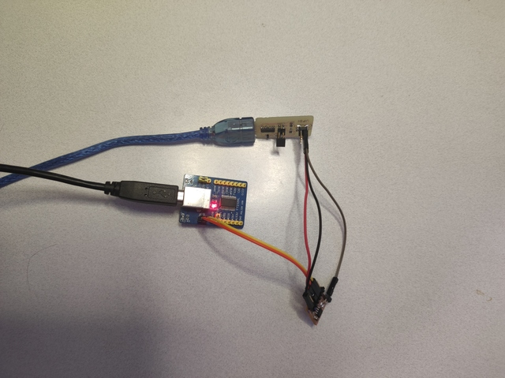|
||
|Test setup used. UPDI, hello.t412.echo and USB serial.|

## Files

- [linetest.png.rml](../images/week06/linetest/linetest.png.rml)
- [linetest.interior.png.rml](../images/week06/linetest/linetest.interior.png.rml)

## Final thoughts

This week I learned the basics of milling a PCB. I have designed and milled some PCBs many many years ago, but I no longer remember the process very well. Also, in the past back then I used a real PCB milling machine and not a universal milling machine like the Roland MonoFab SRM-20. Now I gained more experience from Roland and a little less from LPKF ProtoMat S62. Soldering this simple device was nothing new to me. Also, Arduino and device programming was something that I was already very familiar with. 

