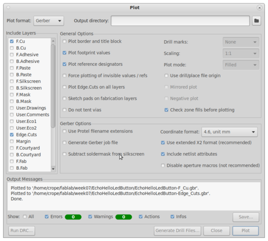
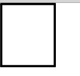
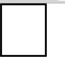

# 7. Electronics design

Assignment:

Group assignment:

use the test equipment in your lab to observe the operation of a micro-controller circuit board

Individual assignment:

redraw an echo hello-world board, add (at least) a button and LED (with current-limiting resistor) check the design rules, make it, and test it
extra credit: simulate its operation

## KiCad 6

We used [KiCad](https://www.kicad.org/) to design the electronics. It’s a widely used open source program and pretty good so there was no need to even evaluate at other options. I have previous experience in electronics design years ago, but the program used has been different and it has been so long since anyway.

### KiCad installation
[A version 6 of the KiCad](https://www.kicad.org/blog/2021/12/KiCad-6.0.0-Release/) design suite has been released recently on 25 December 2021. That version upgrade from 5 to 6 is a major change since earlier version was over 3 years old from the 2018. Our Fab Lab had the latest version installed and I wanted to install it on my workstation as well. I have a slightly old Fedora release 34 at my home workstation with only the older KiCad version 5 supported as native. Luckily, the newer version was easily available from the [Fedora Copr repository](https://copr.fedorainfracloud.org/coprs/g/kicad/kicad/) so I installed it. [KiCad Install on Fedora.](https://www.kicad.org/download/fedora/)

```console
sudo dnf install dnf-plugins-core
sudo dnf copr enable @ kicad / kicad
sudo dnf install kicad
```

### KiCad Fab Lab settings

[Fab electronics component library for KiCad](https://gitlab.fabcloud.org/pub/libraries/electronics/kicad) contains all the official components that should be found in every Fab Lab. The components available in the library are easy to use in KiCad and you don't have to look for components elsewhere or design yourself. There are a huge number of common components in the program anyway and you can use them as well, but then you have to take a closer look at the package of the component that it match for component in Fab Lab, for example.

I followed the installation instructions for the Fab component library on my home computer and used the following settings:

```console
$ cd ~/fablab/
$ git clone https://gitlab.fabcloud.org/pub/libraries/electronics/kicad.git
```

||
||
|KiCad Configure Paths|

||
||
|KiCad Footprint Libraries|

||
||
|KiCad Symbol Libraries|


### KiCad electronic design exercise

I did that standard echo hello device with button and led. First we looked Fab Academy board and made almost similar, having same micro-controller and UART connected to "FTDI" header, but added led and button too. Used micro-controller ATtiny 412 has very limited amount of I/O pins - only 6 - and even one of those is kinda reserved for UPDI programmer. I connected LED between PA7 and VCC in series with 1k resistor to limit current. Button is connected between PA6 and ground having also 10k pull-up resistor to Vcc. Pull-up resistor is not mandatory as I can understand chip already has integrated pull-ups that could be enabled by the software but anyhow now pull-up resistor is here still for sure.


BOM exported from KiCad:

* C1	C	C_1206	1
* R1	1k	R_1206	1
* R2	10k	R_1206	1
* D1	LED	LED_1206	1
* U1	Microcontroller_ATtiny412_SSFR	SOIC-8_3.9x4.9mm_P1.27mm	1
* SW1	BUTTON_B3SN	Button_Omron_B3SN_6x6mm	1
* J1	Conn_PinHeader_FTDI_1x06_P2.54mm_Horizontal_SMD	PinHeader_FTDI_01x06_P2.54mm_Horizontal_SMD	1
* J2	Conn_PinHeader_1x03_P2.54mm_Horizontal_SMD	PinHeader_1x03_P2.54mm_Horizontal_SMD	1

I forgot to add C1 value to design. 1uF was used.

||
||
|Components|


||
||
|KiCad Schematic Editor|


||
||
|KiCad PCB Editor|


||
||
|KiCad PCB Editor - Board Setup used|


||
||
|KiCad Export SVG for Roland MonoFab SRM-20|

||
||
|KiCad Plot Gerber for LPKF ProtoMat S62|


#### Mods fails to generate toolpath
I exported PCB as a vector two images from KiCad, one image for traces and  other image as board outline. After that I used [mods](https://mods.cba.mit.edu/) tool to make toolpaths for Roland monoFab SRM-20 milling machine. For that point I had a lot of problems - I could not understand why my PCB borders were all the time wrong. I tried all relevant KiCad export settings vary many times, tweaked with KiCad PCB borders (Edge Cuts layer) and some other layers but still it was always wrong and mods generated totally bad looking toolpaths which I sure didn't even want to test mill. Eventually I decided to open PCB borders file directly with my browser, Firefox, and saw the borders image were still rendered as badly as mods running on Firefox browser. At that point I started suspect it may be issue with used browser and its svg-libraries. Then I decided to install Chromium browser (it is open source version of Google Chrome) as it was available on Fedora package management. That browser shows svg-file correctly, but then I ran other problem with mods when used Chromium browser - it fails to generate toolpath itself! Two steps forward and one step back :( After mods was find out to be broken with both Firefox and Chromium I started looking yet another browser. That browser was Google Chrome. I installed it from package available from vendor site. And finally it was a browser which works with mods on that single case at least. Too many compatibility issues - I have to say I am feeling mods is not best tool to mill PCB boards.

Here is pictures how simple PCB border in SVG format from KiCad is rendered on different applications. Firefox fails it badly.


||
||
|PCB borders .SVG on Firefox|

||
||
|PCB borders .SVG on Chromium|

||
||
|PCB borders .SVG on Google Chrome|

||
||
|PCB borders .SVG on Inkscape|


#### Different PCB mills

From KiCad PCB Editor I made both SVG-images and Gerber files of my PCB design. I made 2 PCBs using different milling machines, Roland MonoFab SRM-20 and LPKF ProtoMat S62. For Roland it was tricky to do PCB with that small traces as I used 0.4mm for Track Width and 0.25mm for Clearance. After two failed attempts I started adjusting trace milling depth from 0.05mm to 0.10mm by manual adjusting cut depth from step by step deeper until it was fine. 0.2-0.5mm V-shaped drill bit was used.


||
||
|PCB v1 on Roland. It is bad.|

||
||
|PCB v2 on Roland. It is OK.|

||
||
|PCB v2 on LPKF. It is OK.|


### Device

||
||
|Soldering|


||
||
|Testing|

I used Fab Academy [hello.t412.echo.ino](http://academy.cba.mit.edu/classes/embedded_programming/t412/hello.t412.echo.ino) code to test it.

To test LED I make minor modifications;

```
setup() function:
pinMode(PIN_PA7, OUTPUT);

loop() function:
digitalWrite(PIN_PA7, HIGH);
delay(1000);
digitalWrite(PIN_PA7, LOW);
delay(1000);
```

LED blinks slowly as expected.


Compiling:

```console
Sketch uses 1918 bytes (46%) of program storage space. Maximum is 4096 bytes.
Global variables use 91 bytes (35%) of dynamic memory, leaving 165 bytes for local variables. Maximum is 256 bytes.
SerialUPDI
```

Programming:
```console
UPDI programming for Arduino using a serial adapter
Based on pymcuprog, with significant modifications
By Quentin Bolsee and Spence Konde
Version 1.2.3 - Jan 2022
Using serial port /dev/ttyACM0 at 57600 baud.
Target: attiny412
Set fuses: ['2:0x02', '6:0x04', '8:0x00']
Action: write
File: /tmp/arduino_build_271734/hello.t412.echo.ino.hex
Pinging device...
Ping response: 1E9223
Setting fuse 0x2=0x2
Writing literal values...
Verifying literal values...
Action took 0.02s
Setting fuse 0x6=0x4
Writing literal values...
Verifying literal values...
Action took 0.02s
Setting fuse 0x8=0x0
Writing literal values...
Verifying literal values...
Action took 0.02s
Finished writing fuses.
Chip/Bulk erase,
Memory type eeprom is conditionally erased (depending upon EESAVE fuse setting)
Memory type flash is always erased
Memory type lockbits is always erased
...
Erased.
Action took 0.01s
Writing from hex file...
Writing flash...
[==================================================] 30/30
Action took 0.65s
Verifying...
[==================================================] 4/4
Verify successful. Data in flash matches data in specified hex-file
Action took 0.42s
```

Testing serial port:
```console
$ python -m serial.tools.miniterm /dev/ttyUSB0 115200
--- Miniterm on /dev/ttyUSB0  115200,8,N,1 ---
--- Quit: Ctrl+] | Menu: Ctrl+T | Help: Ctrl+T followed by Ctrl+H ---
hello.t412.echo: you typed "F"
hello.t412.echo: you typed "Fa"
hello.t412.echo: you typed "Fab"
hello.t412.echo: you typed "Fab "
hello.t412.echo: you typed "Fab L"
hello.t412.echo: you typed "Fab La"
hello.t412.echo: you typed "Fab Lab"
hello.t412.echo: you typed "Fab Lab "
hello.t412.echo: you typed "Fab Lab O"
hello.t412.echo: you typed "Fab Lab Ou"
hello.t412.echo: you typed "Fab Lab Oul"
hello.t412.echo: you typed "Fab Lab Oulu"

--- exit ---
$ 
```

