# 8. Input devices

> ## Assignment
>
> ### Individual assignment
>
> - Measure something: add a sensor to a microcontroller board that you have designed and read it
>
> ### Group assignment
>
> - Probe an input device's analog levels and digital signals

## New week, new board - ESP32

I decided to make a new circuit board with lots of I/O pins for this week. The intention is that I will cope with a new board throughout this course serie. I have been thinking of using the [Espressif ESP32](https://www.espressif.com/en/products/socs/esp32) chip for the final project so I chose it as the microcontroller for the new board. Thus, I am already gaining experience with that microcontroller at the same. 

I designed the schematic and the PCB like in previous exercises with KiCad. I wanted to make the board as compact as possible, using surface mount technology and a single sided PCB. This posed some challenges, among other things, to the widths and clearances of the tracks used, which had to be made quite narrow. Another factor influencing the size of the tracks is the circuit board milling technology used, which also sets its own requirements. Because our lab has a decent circuit board milling machine, LPKF ProtoMat S62, I decided to use it to achieve a better end result and my requirements, and I didn’t even try to use generic milling machine according to Fab Academy processes. Our milling machine generally uses a 0.2-0.5mm V-bit, based on which I selected 0.2mm clearance and 0.25mm track witdh. For the operating current tracks, I used a slightly bigger witdh. 

|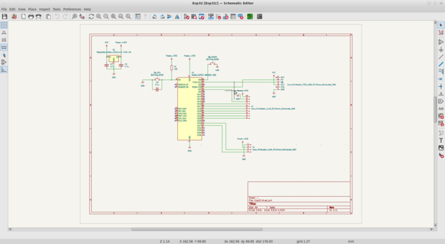|
||
|KiCad Schematic|

|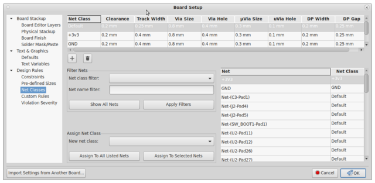|
||
|KiCad Net Classes|

|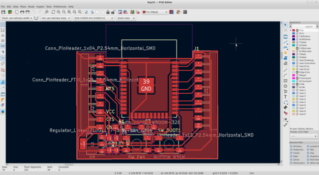|
||
|KiCad PCB|

The ESP32 data sheet set some requirements such as operating voltage and minimum current ​​as well as programming interface connections. The ESP32 requirement for operating current is 3.3V and at least 500mA. There were only 100mA and 1A regulators on the Fab Lab shelf so I used a 1A regulator. Other components required for power supply were found in the regulator data sheet. The reset and programming button connections with their peripherals are found from the ESP32 data sheet. 

## Circuit board assembly

Assembling the circuit board succeeded without major problems. ESP32 [WROOM-32E](https://www.espressif.com/en/products/modules), the module I used, was a little difficult to solder because the legs in it were like a 90-degree angle to the surface of the circuit board. Luckily, I had a [QuadHands Jumbo Workbench](https://www.quadhands.com/products/quadhands-jumbo-workbench) in my home lab with which I got the circuit board at a suitable angle so that the soldering could be done with ease. 

|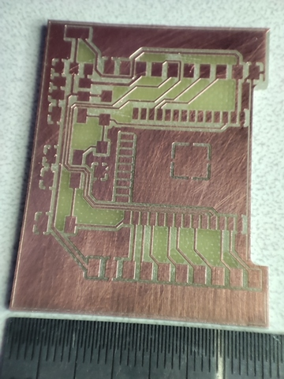|
||
|Milled PCB|

|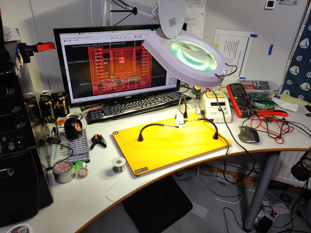|
||
|Component assembly|

Schematic had 4.7uF capacitors in the regulator input and output as instructed by the regulator data sheet, but since there were no parts of that size on the shelf, I replaced them with 10uF when I assembled the circuit board. 

## Circuit board testing

After assembly, I did basic tests with a multimeter for possible short circuits. 

My USB serial port uses 5V voltages, so I started thinking if it would be safe to use due to too high a voltages. There was no concern with the operating voltage (Vcc) because the circuit board has a 3.3V regulator but the voltages on the TX/RX lines caused concern. There is no mention in the ESP32 data sheet whether those pins are 5V tolerant or not, so I had to find out if it is safe to plug TX/RX with that high voltage. Searching the internet I found information that all ESP32 digital I/O pins are 5V tolerant, although this is not explicitly mentioned in the data sheet. 

I connected USB serial port adapter to PCB normally, TX, RX, Vcc, GND. I checked the functionality of my board by trying to read the chip id with esptool. After a few attempts, it worked so I knew the circuit would work. Here I had to press the BOOT and EN buttons I had installed on the circuit board a few times. At the same time, it was found that the chip enters programming mode when you hold down the BOOT button and resets the ESP32 with the EN button or by turning on the power. 

``` console
$ esptool --chip esp32 chip_id
esptool.py v2.8
Found 1 serial ports
Serial port /dev/ttyUSB0
Connecting.....
Chip is ESP32D0WDQ6 (revision 1)
Features: WiFi, BT, Dual Core, 240MHz, VRef calibration in efuse, Coding Scheme None
Crystal is 40MHz
MAC: 24:6f:28:86:31:4c
Uploading stub...
Running stub...
Stub running...
Warning: ESP32 has no Chip ID. Reading MAC instead.
MAC: 24:6f:28:86:31:4c
Hard resetting via RTS pin...
$
```

## Temperature sensors

Since my final project is a weather station I decided to use temperature sensors as input devices. I installed two different temperature sensors, a [Aosong Electronics DHT11](http://www.aosong.com/en/products-21.html) and a 10k NTC thermistor ([Amphenol Advanced Sensors NHQ103B375T10](https://www.amphenol-sensors.com/en/thermometrics/ntc-thermistors/smd/951-smd)). The DHT11 was a ready-made module with one data line in addition to the operating power interface. NTC thermistor is connected using simple voltage divider circuit to the ESP32 ADC converter. 

|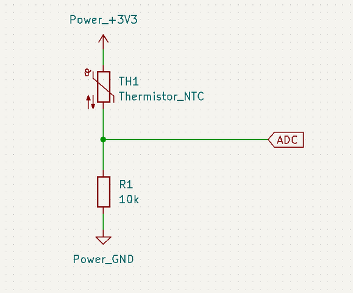|
||
|NTC thermistor voltage divider|

I installed a DHT11 sensor on the IO26 pin and an NTC thermistor circuit on the IO4 pin which has the ADC converter. 

I decided to test the temperature sensors with a small snippet of code. For code development, I used Arduino where I installed ESP32 support with the Board Manager at: [https://dl.espressif.com/dl/package_esp32_index.json](https://dl.espressif.com/dl/package_esp32_index.json).

From Arduino IDE I selected board:
Tools -> Board -> ESP32 Arduino -> ESP32 Dev Module

For the DHT11 sensor, many libraries were found in the Arduino Library Manager, from which I installed the ["DHT sensor library for ESPx"](https://www.arduino.cc/reference/en/libraries/dht-sensor-library-for-espx/). 

I quickly tested the operation of the sensor with an example program coming with the library and it worked right away. 

However, I still had that another sensor circuit based on NTC thermistor so I started to study the operation of the ADC converter. I read the values ​​of the ADC converter from the microcontroller with the analogRead() function and examined them. The values ​​returned by the function changed when I heated the thermistor with my finger, so it worked more or less, although the read values ​​seemed to be a little lower than expected. I assumed that the ADC converter returns values ​​0-4095 (12-bit resolution) linearly depending on the voltage 0-3.3V connected to the pin. After researching for a while, I realized that there are quite a few configurable things in the ESP32 ADC converter, of which the analogSetAttenuation() function seemed to be quite significant. I connected the adjustable voltage source to the ADC converter and tested using different voltages what kind of values ADC returns. I measured the following maximum possible voltages for each attenuation configuration. 

|analogSetAttenuation()|max voltage measured|
|||
|ADC_0db|1.0V|
|ADC_2_5db|1.3V|
|ADC_6db|1.9V|
|ADC_11db|3.1V|

|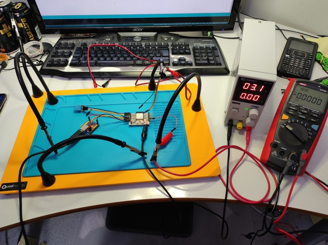|
||
|ADC testing|

Judging from the values, it seems that the ADC of the circuit reads a maximum voltage of 1V, but attenuators are connected in front of the ADC converter, which can increase the value range of the input. Still, those readings and attenuations didn’t really open up for me, but at this point I couldn’t get to know the matter further. Since when heating the NTC with the ADC_6db setting, it still saturates the ADC converter, I used the ADC_11db setting and scaled the values ​​to the measured 3.1V voltage so that I got about the correct values. That was enough at this point. 

I was able to read the values ​​from the device via the serial port as text and graphs with the Arduino serial plotter function. 

|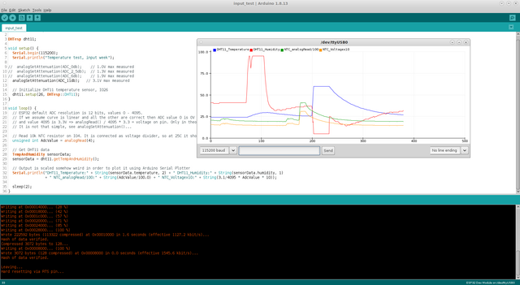|
||
|Arduino temperature sensor graphs|

The graph shows how the values ​​given by the sensors change as they are heated. I used a hot air gun so the highest readings should probably be somewhere near 80 degrees Celsius. 

``` c
#include "DHTesp.h"

DHTesp dht11;

void setup() {
  Serial.begin(115200);
  Serial.println("Temperature test, input week");

//  analogSetAttenuation(ADC_0db);    // 1.0V max measured
//  analogSetAttenuation(ADC_2_5db);  // 1.3V max measured
//  analogSetAttenuation(ADC_6db);    // 1.9V max measured
  analogSetAttenuation(ADC_11db);   // 3.1V max measured

  // Initialize DHT11 temperature sensor, IO26
  dht11.setup(26, DHTesp::DHT11);
}

void loop() {
  // ESP32 default ADC resolution is 12 bits, values 0 - 4095.
  // If we assume curve is linear and all the other are correct then ADC value 0 is 0V
  // and value 4095 is 3.3V => analogRead() / 4095 * 3.3 = voltage on pin. Only in theory.
  // It is not that simple, see analogSetAttenuation()...

  // Read 10k NTC thermistor on IO4. It is connected as voltage divider, so at 25C it should be 0.5 * 3.3V = 1.65V
  unsigned int AdcValue = analogRead(4);
  
  // Get DHT11 data
  TempAndHumidity sensorData;
  sensorData = dht11.getTempAndHumidity();

  // Output is scaled somehow weird in order to plot it using Arduino Serial Plotter
  Serial.println("DHT11_Temperature:" + String(sensorData.temperature, 2) + " DHT11_Humidity:" + String(sensorData.humidity, 1)
                 + " NTC_analogRead/100:" + String(AdcValue/100.0) + " NTC_Voltagex10:" + String(3.1/4095 * AdcValue * 10));

  sleep(2);
}
```

## Oscilloscope exercise

I used an oscilloscope to measure the digital signal from the DHT11 sensor data line and the analog signal from the NTC thermistor circuit. I used [LabNation SmartScope](https://www.lab-nation.com/) for measurements, which is a small oscilloscope with a USB connection. 

|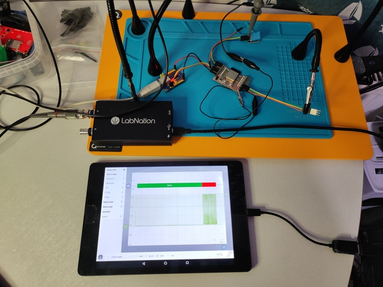|
||
|Measurement setup|

### NTC thermistor circuit

|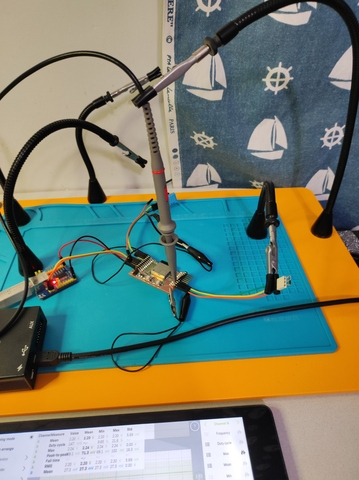|
||
|NTC thermistor circuit DUT|

The voltage change from the NTC thermistor is not very interesting to measure with an oscilloscope, but I still got some curves - at least you can see how quickly it reacts to the temperature change. In this measurement I also used hot air gun. At 1m40, the graph shows how the voltage has risen to about 3.3V. From this it can be concluded that it is likely that the ADC is saturated and thus no actual temperature has been transmitted to the program, i.e. the voltage distribution used would not work for very high temperatures - maybe the same will happen for cold temperatures? 

|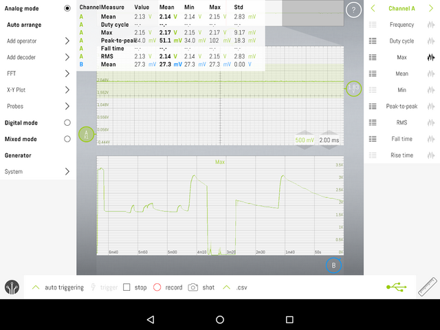|
||
|NTC thermistor measurement|

### DHT11 sensor

|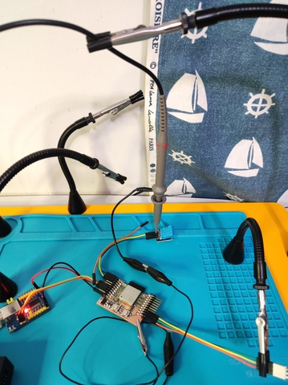|
||
|DHT11 DUT|

The DHT11 measurement was a bit more interesting. I connected the oscilloscope to the data line of the DHT11 module, turned on the oscilloscope "single trigger" and let it take one sample of the sensor. The measurement shows that the bus is in idle state HIGH. The host (ESP32) then pulls the bus down for about 18ms, asking the sensor to deliver the measurement result. The sensor responds with a data burst of 4ms or less. In the burst, there is a space between each symbol in LOW mode about 52us. Bit value 0 is 25us HIGH, bit value 1 is 70us - assuming there is more zeros than the ones in the payload. 

|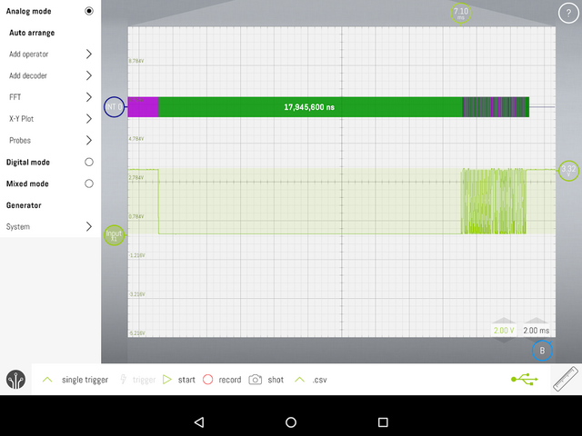|
||
|Captured measurement, whole sequence|

My oscilloscope has some protocol decoders like I2C and 1-wire, but none of those were able to decode data. I used "Edge intervals" decoder for both rising and falling edges in order to get timing calculated. That decoder produced something visual (color bars) that can be read somehow rather easily. Payload on that sample seems to be 41 bit long "0010000000000000000110010000001100111100". That bit string has temperature and humidity information encoded either in analog sensor values ​​or even as precalculated temperature degrees and humidity percentages. 

|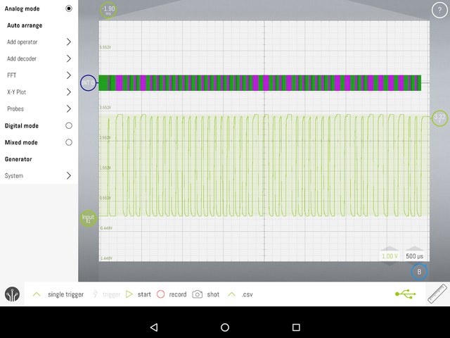|
||
|Sensor data. 0010000000000000000110010000001100111100, 41bits.|

|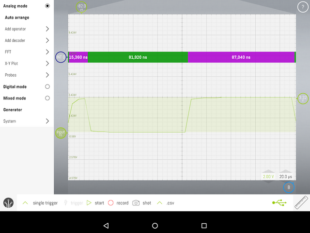|
||
|Start marker. Around 15us HIGH + 85us LOW + 85us HIGH|

|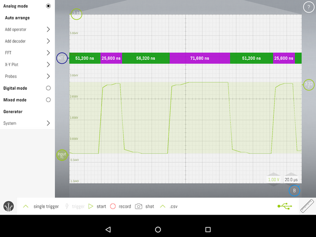|
||
|Space between each symbol. LOW around 52us. That translates to 0b010.|

## References 

- [Espressif ESP32](https://www.espressif.com/en/products/socs/esp32)
- [Aosong Electronics DHT11](http://www.aosong.com/en/products-21.html)
- [Amphenol Advanced Sensors NHQ103B375T10](https://www.amphenol-sensors.com/en/thermometrics/ntc-thermistors/smd/951-smd)
- [LabNation SmartScope](https://www.lab-nation.com/)

## Files

- [Esp32.zip](../images/week08/Esp32.zip)
- [input_test.ino](../images/week08/input_test.ino)

## Final thoughts

I didn't learn almost anything this week, but used too much time for making this documentation. 

