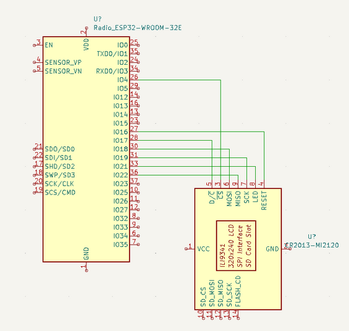
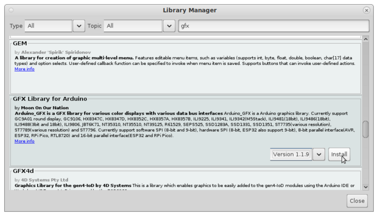
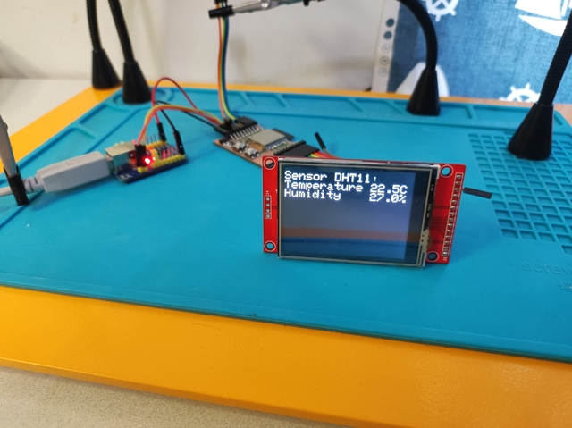
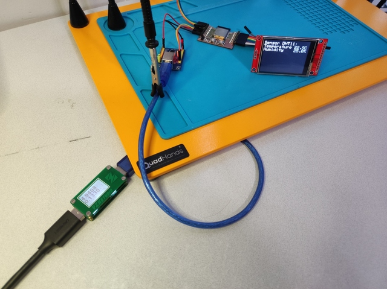
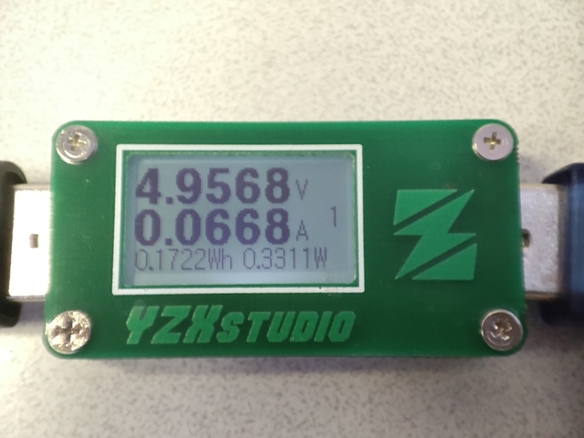

# 9. Output devices

> ## Assignment
>
> ### Individual assignment
>
> - Add an output device to a microcontroller board you've designed and program it to do something.
>
> ### Group assignment
>
> - Measure the power consumption of an output device

## TFT display

This week I decided to add a display to the thermometer I made the previous week. I compared the displays on the Fab Lab component rack and ended up with a 2.4" SPI TFT Module (SKU: MSP2402) because it seemed interesting and had an SPI bus that I have a little less experience than the I2C bus. The ESP32 board I made last week also has enough I/O pins to connect the display so there is no problem either. The display has an ILI9341 control chip and a resolution of 240x320. The display module also has an SD card reader and a touch screen which I did not intend to use however. 

### Display wiring

I followed the instructions on [techtutorialsx - ESP32: ILI9341 Display Hello world](https://techtutorialsx.com/2021/01/31/esp32-ili9341-display-hello-world/) to connect and test display. I connected the data lines of the display as shown by following schematic.

||
||
|Display wiring|

``` c
#define TFT_SCK    19
#define TFT_MOSI   18
#define TFT_MISO   22
#define TFT_CS     4
#define TFT_DC     17
#define TFT_RESET  16
#define TFT_LED    21
```

The display backlight is not controlled through the library but directly from my test program. It can be feed with voltages 0-3.3V to obtain different brightnesses for the backlight. I connected the backlight directly to the normal I/O pin, allowing the light to be turned on or off by the ESP32. When connecting to the DAC output, the brightness could be adjusted by adjusting voltage levels, but I didn't do it now. 

### Display library for Arduino

I installed [GFX Library for Arduino](https://www.arduino.cc/reference/en/libraries/gfx-library-for-arduino/) from the Arduino Library Manager.

||
||
|GFX Library for Arduino|

### Test code

I added the initialization of the display according to the instructions of [techtutorialsx - ESP32: ILI9341 Display Hello world](https://techtutorialsx.com/2021/01/31/esp32-ili9341-display-hello-world/) to the program I made during the input week. The backlight did not illuminate because the backlight currents were wired from the I/O pin which could not be controlled through the display library. So I coded the I/O pin used for display backlight to HIGH mode to supply power. I tested the screen by printing "Hello World" and it worked. I then tested to change the display background colors, text size, text color, and rotated the screen horizontally because it was by default in the vertical position. Once the display was working and I had tested the basics I added logic that prints the temperature and humidity from the DHT11 sensor to the display.
The board has a push button on the IO4 pin that puts the ESP32 chip into programming mode when the button is pressed during chip start. I got the idea to add logic to this button that it turns the display backlight on/off while the device is running, so I added it. 

||
||
|Connected display|

``` c
#include "DHTesp.h"
#include <Arduino_GFX_Library.h>

DHTesp dht11;

// TFT - ESP32 dispay data pins used
#define TFT_SCK    19
#define TFT_MOSI   18
#define TFT_MISO   22
#define TFT_CS     4
#define TFT_DC     17
#define TFT_RESET  16
#define TFT_LED    21

// https://techtutorialsx.com/2021/01/31/esp32-ili9341-display-hello-world/

Arduino_ESP32SPI bus = Arduino_ESP32SPI(TFT_DC, TFT_CS, TFT_SCK, TFT_MOSI, TFT_MISO);
Arduino_ILI9341 display = Arduino_ILI9341(&bus, TFT_RESET);

void setup() {
  Serial.begin(115200);
  Serial.println("TFT test, output week");

  // Initialize DHT11 temperature sensor, IO26
  dht11.setup(26, DHTesp::DHT11);

  // Power on TFT display light
  pinMode(TFT_LED, OUTPUT);
  digitalWrite(TFT_LED, HIGH);

  // Initialize TFT display
  display.begin(); // Init
  display.setTextSize(3);
  display.setTextColor(WHITE);
  display.setRotation(1); // Horizontal
}

void loop() {
  TempAndHumidity sensorData;
  sensorData = dht11.getTempAndHumidity();
  Serial.println("DHT11 Temperature:" + String(sensorData.temperature, 2) + " Humidity:" + String(sensorData.humidity, 1));

  // Use BOOT button to toggle TFT display light ON/OFF
  if (!digitalRead(0))
    digitalWrite(TFT_LED, !digitalRead(TFT_LED));

  display.setCursor(0, 10);
  display.fillScreen(BLACK);
  display.print("Sensor DHT11:\n" "Temperature " + String(sensorData.temperature, 1) + "C\n" + "Humidity    " + String(sensorData.humidity, 1) + "%");

  sleep(2);
}
```

## TFT display power consumption

||
||
|Measurement setup|

I measured the power consumed by the display with a YZXStudio ZY1266 USB power meter. I connected the meter to the USB cable between the computer and the USB-serial adapter and performed 4 different power measurements: display on with black background, display on with white background, display off by I/O, and display completely disconnected (all wires disconnected physically). From these results, the current consumed by the display can be calculated.

|power consumption|operation mode|
|||
|0.67W|display on, black background|
|0.67W|display on, white background|
|0.37W|display LED off, LED pin 0V|
|0.33W|display physically removed|

||
||
|YZXStudio ZY1266 USB power meter|

From the measurement results, it can be calculated that the display consumes about 0.34W of power (0.67W - 0.33W = 0.34W), which is about half of the whole hardware. It is noteworthy that the measurements also include the power consumption of the USB-serial adapter - I did not measure a value for it, but presumably it is small compared to other components. 

## Files

- [ili9341_tft_test.ino](../images/week09/ili9341_tft_test.ino)

## Final thoughts

I have a fair amount of previous experience with microcontrollers and embedded devices, so I didn’t learn much new this week either. This time, however, the workload remained reasonable, which I am pleased with. 

