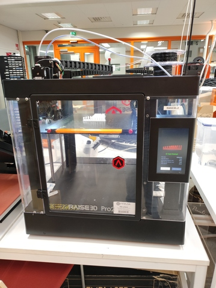
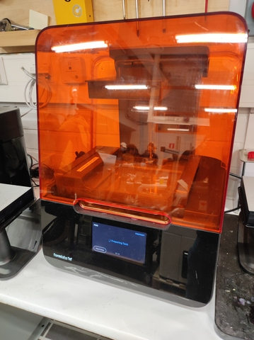
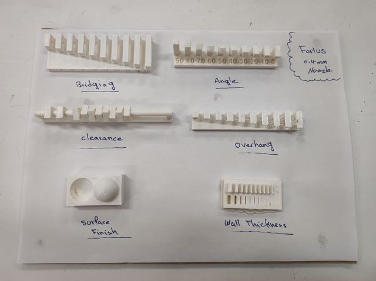
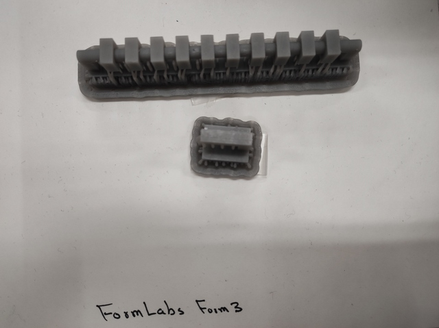
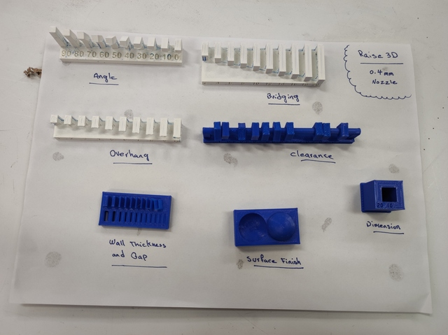
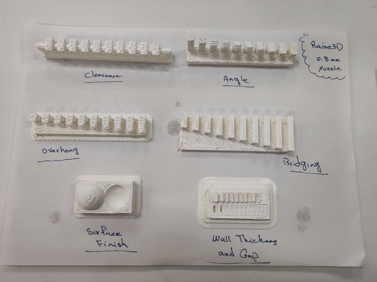

# 14. 3D Scanning and Printing

> ## Assignment
>
> ### Individual assignment
>
> - ?
>
> ### Group assignment
>
> - Test the design rules for your 3D printer(s)

## 3D printer tests - group work

Test done by Kecheng Zhang and Antti Palosaari.

Different 3D printers have different features due to the operating principles of the devices, the mechanics used, and the software used. We tested 3 different devices: Formlabs Form 3+, Stratasys Fortus 380mc and Raise3D Pro2. Pro2 was tested twice with different sized nozzles, 0.4mm and 0.8mm. There are a lot of settings in the printer settings that affect print quality in one direction or another, but the tests performed were intended to provide some insight into the capabilities of the printers in use. 

### [Stratasys Fortus 380mc](https://support.stratasys.com/en/printers/fdm-legacy/fortus-380) 

||
||
|Stratasys Fortus 380mc|

Build volume: 356×305×305 mm 

Printing technology: Fused filament fabrication (FFF) 

Does not support PLA filament?

### [Raise3D Pro2](https://www.raise3d.com/products/pro2-3d-printer/)

||
||
|Raise3D Pro2|

Build volume: 305×305×300 mm 

Printing technology: Fused filament fabrication (FFF) 

### [Formlabs Form 3+](https://formlabs.com/3d-printers/form-3/)

||
||
|Formlabs Form 3+|

Build volume: 145 × 145 × 185 mm 

Printing technology: Stereolithography (SLA) 

### Test results

|printer nozzle filament|Fortus 380mc 0.4 mm ABS|Form 3+ 0.08 mm Tough 1500 Resin|Pro2 0.4 mm PLA|Pro2 0.8 mm PLA|
|               |                        |                    |                |                      |
|OVERHANG       |                        |≤ 6mm               |≤ 1mm           |≤ 2mm                 |
|OVERHANG ANGLE |≥ 30°                   |                    |≥ 20°           |≥ 20°                 |
|CLEARANCE      |≥ 0.3mm                 |≥ 0.6mm             |≥ 0.2mm         |≥ 1.0mm fails totally |
|BRIDGE / SPAN  |                        |                    |≤ 18mm          |≤ 20mm                |
|WALL THICKNESS |≥ 0.3mm                 |                    |≥ 0.2mm         |≥ 0.4mm               |
|GAP            |≥ 0.3mm                 |                    |≥ 0.1mm         |≥ 2mm                 |
|DIMENSION      |9.70mm                  |                    |9.97mm          |9.20mm                |
|SURFACE FINNISH|7/10                    |                    |8/10            |1/10                  |

||
||
|Stratasys Fortus 380mc|

||
||
|Formlabs Form 3+|

||
||
|Raise3D Pro2, 0.4mm nozzle|

||
||
|Raise3D Pro2, 0.8mm nozzle|

Raise3D Pro2 with 0.4mm nozzle does very nice looking print!

## Final thoughts

Hello World.
