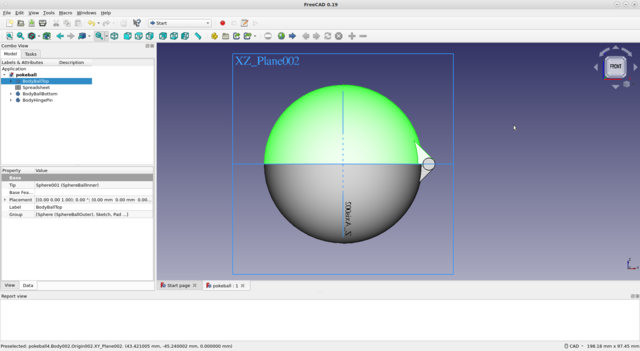

# 14. 3D Scanning and Printing

> ## Assignment
>
> ### Individual assignment
>
> - ?
>
> ### Group assignment
>
> - Test the design rules for your 3D printer(s)

## 3D printer tests - group work

Test done by Kecheng Zhang and Antti Palosaari.

Different 3D printers have different features due to the operating principles of the devices, the mechanics used, and the software used. We tested 3 different devices: Formlabs Form 3+, Stratasys Fortus 380mc and Raise3D Pro2. Pro2 was tested twice with different sized nozzles, 0.4mm and 0.8mm. There are a lot of settings in the printer settings that affect print quality in one direction or another, but the tests performed were intended to provide some insight into the capabilities of the printers in use. 

### [Stratasys Fortus 380mc](https://support.stratasys.com/en/printers/fdm-legacy/fortus-380) 

||
||
|Stratasys Fortus 380mc|

Build volume: 356×305×305 mm 

Printing technology: Fused filament fabrication (FFF) 

Does not support PLA filament?

### [Raise3D Pro2](https://www.raise3d.com/products/pro2-3d-printer/)

||
||
|Raise3D Pro2|

Build volume: 305×305×300 mm 

Printing technology: Fused filament fabrication (FFF) 

### [Formlabs Form 3+](https://formlabs.com/3d-printers/form-3/)

||
||
|Formlabs Form 3+|

Build volume: 145 × 145 × 185 mm 

Printing technology: Stereolithography (SLA) 

### Test results

|printer nozzle filament|Fortus 380mc 0.4 mm ABS|Form 3+ 0.08 mm Tough 1500 Resin|Pro2 0.4 mm PLA|Pro2 0.8 mm PLA|
|               |                        |                    |                |                      |
|OVERHANG       |≤ 1mm                   |≤ 6mm               |≤ 1mm           |≤ 2mm                 |
|OVERHANG ANGLE |≥ 30°                   |-                   |≥ 20°           |≥ 20°                 |
|CLEARANCE      |≥ 0.3mm                 |≥ 0.6mm             |≥ 0.2mm         |≥ 1.0mm fails totally |
|BRIDGE / SPAN  |≤ 14mm                  |-                   |≤ 18mm          |≤ 20mm                |
|WALL THICKNESS |≥ 0.3mm                 |-                   |≥ 0.2mm         |≥ 0.4mm               |
|GAP            |≥ 0.3mm                 |-                   |≥ 0.1mm         |≥ 2mm                 |
|DIMENSION      |9.70/10.0mm             |-                   |9.97/10.0mm     |9.20/10.0mm           |
|SURFACE FINNISH|7/10                    |10/10 [*]           |8/10            |1/10                  |

[*] The surface finish is best with the Formlabs Form 3+ printer, although we did not perform a similar surface test on it. The smoothness of the surface is clearly visible from other printed test pieces. 

||
||
|Stratasys Fortus 380mc|

||
||
|Formlabs Form 3+|

||
||
|Formlabs Form 3+ overhang|

||
||
|Raise3D Pro2, 0.4mm nozzle|

||
||
|Raise3D Pro2, 0.8mm nozzle|

Raise3D Pro2 with 0.4mm nozzle does very nice looking print!

## 3D Design Pokeball

As a 3D printing exercise, I designed a simple Pokemon ball. In the designed ball, the requirement for the exercise task is met by the hinge structure used. The pin of the hinge goes inside the hinge so that it cannot be installed there when manufactured from separate parts. 

||
||
|Pokeball|

The ball is like a box with lids connected by a hinge. The object consists of 3 parts, the upper half, the lower half and the hinge pin. All parts are printed at once so that they are mechanically connected during the printing phase.

As a ball model, I used a factory-made toy Pokemon ball. I didn’t care to model the existing Pokemon ball very accurately but made the simplest possible version of it that met the criteria for the exercise task.

First, I created the top side of the ball with FreeCAD.

* I created a half ball with the Additive Sphere tool
* I drew the hinge Sketch and created a pad from it
* I used the LinearPattern tool to Duplicate the hinge
* I removed the inside of the ball with the Subractive Sphere tool

||
||
|Pokeball top part|

||
||
|Pokeball hinge sketch|

The top and bottom of the ball are symmetrical so I created the bottom body by copying the top body, ctrl-c + ctrl-v. The bottom body created by copying had to be rotated to the correct position - select body, mouse right-click, select Transform. It is essential to get the top and bottom hinges fully in place, although it was not difficult with that tool because the rotations required are 180 degrees around the axes.

||
||
|Pokeball bottom part|

The pin of the hinge had to be created as its own body because it is a separate part and is not attached to other parts. The pin had to be connected to the hinge frame somehow so that its position could be bound to the coordinates of the 3D model. I used the Binder tool to transfer geometry from one body to another body. 

||
||
|Pokeball hinge binder|

With Binder, I attached the hinge body from the top of the ball to the hinge pin body. I drew the pin of the hinge using a sketch and made a pad of it. When dimensioning the hinge, I used a clearance value of 0.2mm, which means that the hole in the hinge is 0.4mm larger in diameter than the pin. The value is easy to change from the Spreadsheet tab as needed - as are almost all other values ​​because the model is comprehensively parameterized. 

||
||
|Pokeball hinge pin|

The finished Pokemon ball was in bad shape for 3D printing. To print, the halves of the ball had to open 180 degrees. I did this in the Draft workbench with the Rotate tool. The Rotate tool works in the 2D plane so the ball first had to be placed at the right angle in the 2D plane. At the end of the hinge pin is a surface in the correct position to which the 2D plane can be synchronized - Utilities-> SelectPlane sets the plane to this surface. Set the Snap Center option to On to select the center of rotation of the hinge pin center. Use the Modification-> Rotate tool to open the ball halves.

||
||
|Pokeball rotate|

||
||
|Pokeball rotated open for printing|

I saved the opened ball in .STL format and printed several more and less successful versions of it. I used Raise3D Pro2 and Creality Ender 3 V2 printers.

||
||
|Pokeballs. Blue one is factory made.|

## Final thoughts

Hello World.
