# 15. Molding and Casting

> ## Assignment
>
> ### Individual assignment
>
> - Design a mold around the stock and tooling that you'll be using, mill it (rough cut + three-axis finish cut), and use it to cast parts
>
> ### Group assignment
>
> - Review the safety data sheets for each of your molding and casting materials, then make and compare test casts with each of them

## Making Pokeball 

As a casting exercise, I made a plastic mold and casted a Pokemon ball that I had previously designed as a 3D printing exercise. 

The process went through the following steps:

* I milled a wax mold from a 3D model of a Pokemon ball
* I made a silicone mold into a wax mold
* I made a plastic cast into a silicone mold

### Making a wax mold

I made the wax mold with a Roland monoFab SRM-20 milling machine using Roland MODELA Player 4 application. I imported into the MODELA Player 4 a previously designed Pokemon ball that was in .stl format. The Pokemon ball was in its closed position, so it was completely ball shaped except for the hinges. The size of the ball was reduced to about 35mm in diameter. Due to the shape of the object, I had to create two molds - a top and a bottom. The application knew how to make two molds directly from the model, so I created "Top Surface" and "Bottom Surface" with it. To each of these Surfaces I added the "Roughing" and "Finishing" processes, which are practically milling toolpaths. The roughing process mills the mold shapes and finishing is for surface finishing. As a milling tool, I defined and used a 3mm ball mill for each process. This was a slightly poor choice because the mill in question could not cut the edges quite straight from the bottom of the mold due to the ball shape of the mill, resulting in a casting seam about 1mm high into the final ball. 

|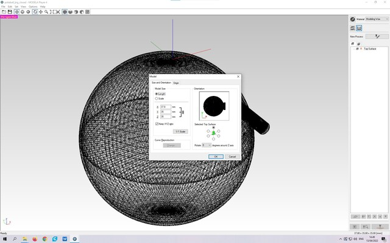|
||
|Resize Pokemon ball|

In creating the process, I changed the "Set the cutting area and depth" setting to "Partial" and divided the "Depth" by two. The 3D model is an entire ball, but the mold is only half of it. I selected "Modeling Wax" and the tool "R1.5 Ball" as the material, based on which the program selected the appropriate milling settings. Used material and tool definitions were made by someone else on our FabLab for that machine. 

|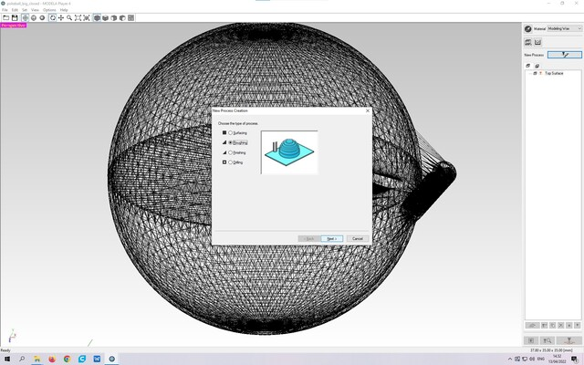|
||
|Create milling process|

|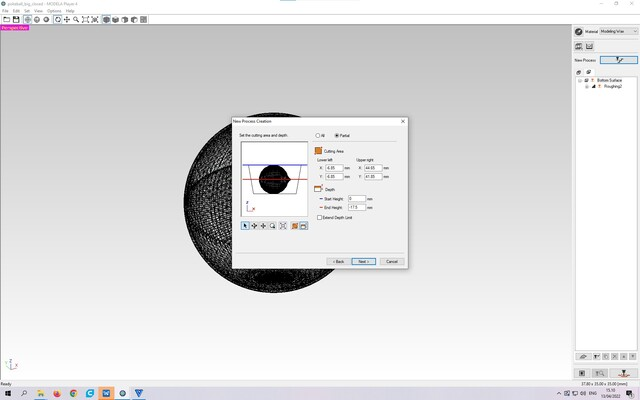|
||
|Select half of ball|

|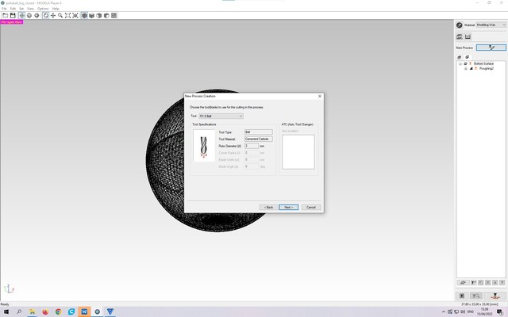|
||
|Select 3mm ball milling bit|

MODELA Player 4 created 4 toolpaths for SRM-20 milling machine, "Roughing" and "Finishing" for both the top and bottom of the ball from the above definitions. 

I covered the milling machine bed with masking tape and glued the wax mold with hot glue to that tape. The tape is used for protecting the bed from glue splashes. 

I used the VPanel for SRM-20 program to drive the cutter. I installed the specified mill bit on the milling machine and calibrated the X/Y/Z origin. I loaded the toolpaths made in MODELA Player 4 into the VPanel app and first milled the other half of the ball into the wax mold. I recalibrated the origin and milled the other half of the ball next to the previous one. 

|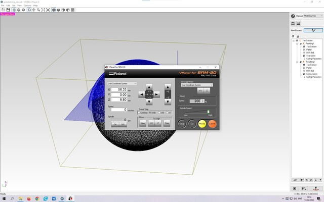|
||
|Mill wax mold using VPanel for SRM-20|

### Making a silicone rubber mold

After making the wax mold, I started making silicone rubber molds. Our Fab Lab had OOMOO 25 and Smooth‑Sil 940 silicone manufactured by Smooth-On, from which I selected Smooth‑Sil 940. The silicone used is mixed from the two components A and B by weight in a ratio of 100A:10B. 

|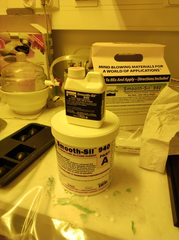|
||
|Smooth-On Smooth‑Sil 940|

I switch on laboratory ventilation, wear protective clothing, safety goggles and vinyl gloves. I added the required amount of component A to the plastic cup and then added the required amount of component B, measuring the correct amount with a small scale. 

|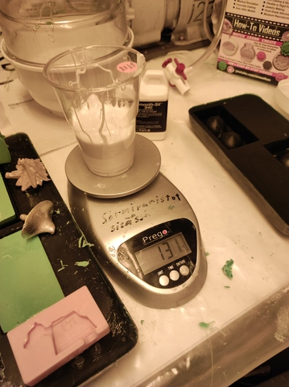|
||
|Smooth‑Sil 940 mix A|

|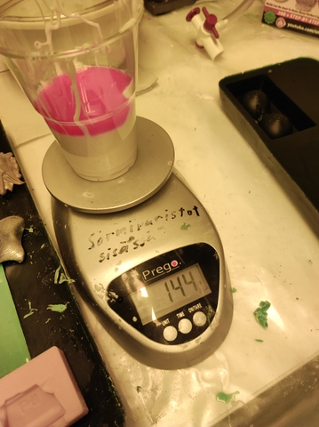|
||
|Smooth‑Sil 940 mix A+B|

I mixed it thoroughly and put it to vacuum pump for degassing for a while. 

|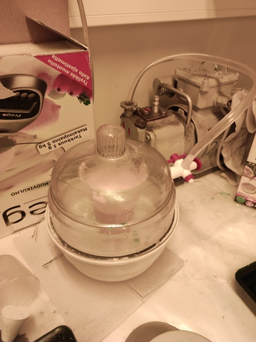|
||
|Smooth‑Sil 940 vacuum degassing|

Finally, I casted silicone into my wax mold. The silicone was left a little over so I casted the rest into another test mold which I had milled into the same wax mold. Cure time for the silicone used was 24 hours so I left the casting to dry overnight in the lab. 

|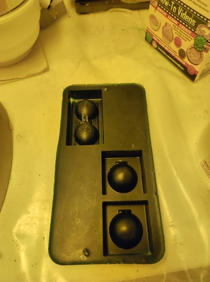|
||
|Wax mold|

|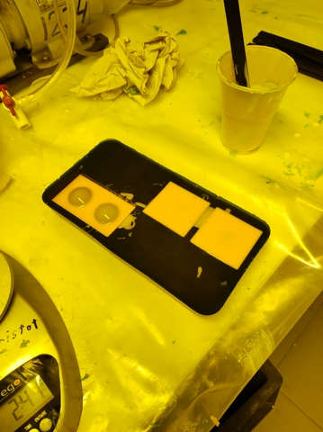|
||
|Wax mold, silicone casted|

The next day I took the casting out of the mold a little ahead of time, about after 20h drying. Silicone rubber is a flexible material and came off the wax mold easily. 

|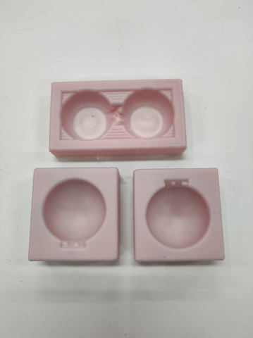|
||
|Silicone rubber molds|

The silicone rubber mold for the Pokemon ball is double-sided and had no filler hole, so after thinking, I decided to drill a filler hole into it with a small column drill. The mold was ready. 

|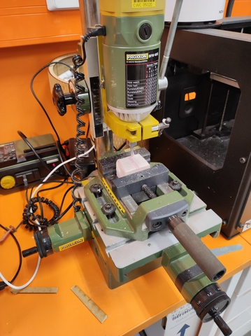|
||
|Drill fill hole|

### Casting plastic Pokemon ball 

The final cast was a small Pokemon ball. The ball casting was done into a previously made silicone rubber mold. As the plastic, I used the Smooth-Cast 305 plastic from Smooth-On found from the Fab Lab. 

I taped the halves of the silicone rubber mold together because the item to be cast was a pokemon ball that was cast in a two-piece mold. I wore protective clothing, safety goggles and rubber gloves. Switch on laboratory room ventilation. I mixed a small amount of Smooth-Cast 305 plastic A + B components into a plastic cup. I mixed the plastic thoroughly and did vacuum degassing even if it wasn’t necessary. I poured the liquid plastic into the molds and left to dry for a while. The plastic hardened really fast, the cure time was only 30 minutes. 

|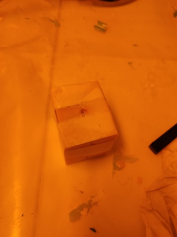|
||
|Plastic cast inside silicone mold|

|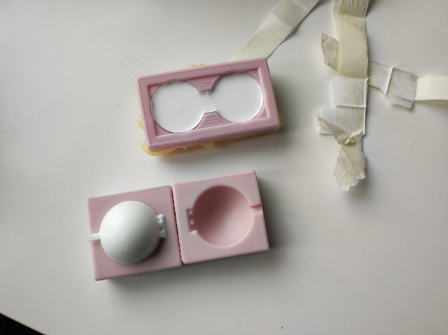|
||
|Cast ready|

The casted ball looked reasonably neat. There was a pretty big seam between the halves of the ball, due to the ball nose milling bit I used to make the wax mold. The seam could be removed mechanically with a knife or sanding, but I didn't care to remove it. 

|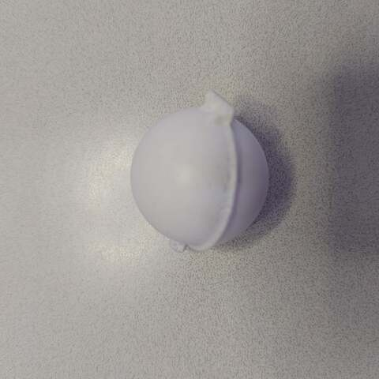|
||
|Pokemon ball I made|

## Final thoughts

Hello World.
