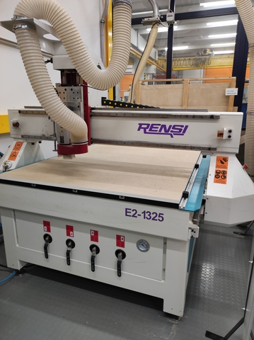
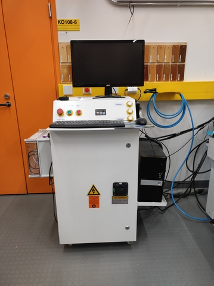
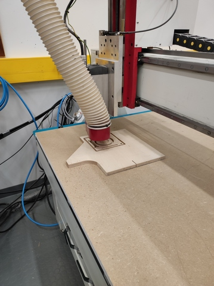
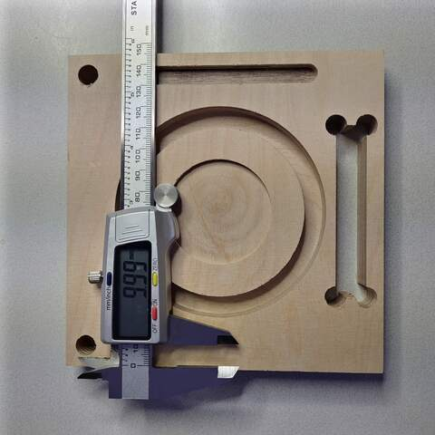

# 16. Computer Controlled Machining

> ## Assignment
>
> ### Group assignment
>
> - Test runout, alignment, speeds, feeds, and toolpaths for your machine
> - Sample file for milling in group work folder
>
> ### Individual assignment
>
> - Make (design+mill+assemble) something big
> - Big = at least one edge of assembled work need to be minimum 1 m long

## CNC router 

Our FabLab has an Excitech E2-1325 CNC router. The device can be found in the woodworking workshop of the mechanical engineering department. Safety instructions must be learned and followed carefully. The device is moderately dangerous when used carelessly due to high forces and a rapidly rotating milling bit. 

||
||
|Excitech E2-1325 router|

||
||
|Excitech E2-1325 controller|

## Milling tests

||
||
|Test plate milling|

||
||
|Test plate ready for measurements|

|                    |Designed|Measured|
|                    |        |        |
|side width up       |150.00  |  149.93|
|side width down     |150.00  |  149.86|
|side height right   |150.00  |  149.94|
|side height left    |150.00  |  149.77|
|circle 1 diameter   | 50.00  |   49.87|
|circle 2 diameter   | 80.00  |   80.00|
|circle 3 diameter   |100.00  |   99.96|
|circle 1 depth      |  3.00  |    3.00|
|circle 2 depth      | 10.00  |   10.04|
|drill hole diameter | 10.00  |    9.98|
|track length        | 89.00  |   88.88|
|track width         |  9.00  |   08.91|
|track depth         |  5.00  |    5.00|
|dog bone length     | 80.00  |   80.01|
|dog bone width      | 14.00  |   14.01|

Test plate material thickness was around 17.1mm. Deviations are negligible. Also, the measurement can easily cause such small errors in the results. Excellent results!

## Post processor

The test plate was modeled with Fusion 360 software. The milling tool paths were also generated with the Fusion 360 CAM. As a post processor, Fusion 360 used something like FabLab's custom processor. 

In principle, the toolpaths are standard G-codes, but in practice there are differences between the device manufacturers. Post processing is a procedure for making manufacturer-specific changes to the G code. 

I use FreeCAD that no one else has used in our FabLab yet with this cutter. I'll try to find out in a week how I can make the process work in FreeCAD and whether it will work without coding a new post processor in FreeCAD. 

NcStudio was controlling softaware used for Excitech E2-1325 CNC. 

## Final thoughts

Hello World.
