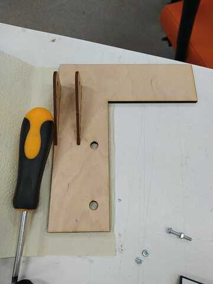
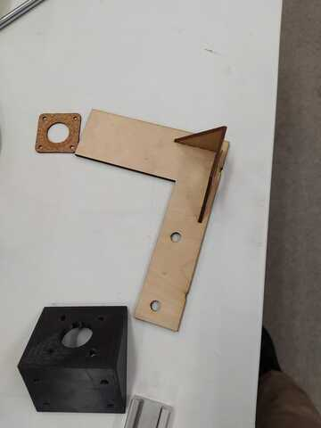

# 18. Mechanical Design (part 1 of 2) 

> ## Assignment
>
> ### Group assignment
>
> - Design a machine that includes mechanism + actuation + automation
> - Build the mechanical parts and operate it manually.
> - Document the group project
>
> ### Individual assignment
>
> - Document your individual contribution.

## Project idea - Pen Plotter 

I did this group work with Aleksi. We chose the design and manufacture of a computer-controlled pen plotter as the topic of the group work. The idea for the group work was Aleksi and he had a bit of previous experience on the subject. 

It was decided to build the device so that in the X/Y-plane the drawing is controlled by two stepper motors, using the traditional mechanics where only the pen moves while the paper stays in place. To lift and lower the pen, the Z-axis uses either a stepper motor or a servomotor. 

Aleksi had a good and very suitable slide rail that it was decided to use as a base for the device. Other suitable parts were searched in Fab Lab and we found NEMA 17 stepper motors, sliding shafts and bearings. We couldn’t find a suitable stepper motor for lifting and lowering the pen so we decided to look into it later. 

||
||
|Finding and selecting suitable parts|

After finding the basic components, we started thinking about how to make the rest of the parts and divide the workload. It was my responsibility to design the mounting of the stepper motor on the slide rail and the mechanics of the pen control. Aleksi is responsible for the design of the stand, the attachment of the slide rail to the stand and the mechanics that move the slide rail using the stepper motor. Aleksi informs me of the dimensions of the slide rail transmission belt attachment so I can design it to the right size. 

## My mechanical design 

||
||
|Mechanics|

||
||
|Mechanics|

### Mounting the stepper motor on the slide rail 

My job was to design the mechanics from the top of the slide rail to the pen. As components, I chose a stepper motor with a threaded rod and an 8mm thick sliding shaft and a bearing suitable for the sliding shaft. The attachment of these parts to the slide rail had to be designed firmly enough for the pen movement mechanism to be stable enough. I chose the 3D-printed plastic mounting bracket as the manufacturing technique. The slide rail had a bracket with 2 bolt holes for mounting. I measured the attachment on the slide rail with a caliper and entered the dimensions into the FreeCAD model. The stepper motor was NEMA 17 compliant, so I took the exact dimensions of the motor mount from the data sheet and modeled the mount with FreeCAD. In addition to the stepper motor, an 8mm sliding shaft was added to the bracket, which I fitted next to the stepper motor so that everything fit nicely into the mounting on the slide rail. The purpose of the sliding shaft is to stabilize the mechanics of the pen holder to a certain position and to enable the use of a threaded shaft. The attached picture should clarify the matter. 

||
||
|Motor mount|

||
||
|Motor mount, 3D printed|

||
||
|Slide rail and shaft mounted|

||
||
|Slide rail and shaft mounted|

### Pen holder version 1 

I modeled a simple pen holder with FreeCAD while making the stepper motor mount bracket. This bracket was almost the simplest possible - it didn’t even have a mechanism for lifting or lowering the pen. The intention was to get only the first prototype ready and see how it could work. Controlling the pen requires some kind of motor and mechanics that have not yet been designed. 

||
||
|Pen Holder v1|

||
||
|Pen holder v1, 3D printed|

||
||
|Installing linear bearing|

### Pen holder version 2 

The pen holder v1 worked as planned - that is, incompletely :). A solution to the pen lifting and lowering mechanism was considered. I wanted to use a stepper motor but the Fab Lab didn’t have a suitably sized motor because it would have to be pretty small. The use of a servomotor was also studied, but the integration of a stepper motor into a control that already had stepper motors seemed easier. Aleksi suggested that the old CD-ROM drive usually has suitably sized stepper motors. Jani said there is a few old computers in the junkyard of the Faculty of Information and Electrical Engineering where CD-ROM drives could be found. I went to retrieve an old computer with 2 CD-ROM drives from the trash. I disassembled the CD-ROM drives and studied their mechanics. One had a normal DC motor and an encoder to read the motor position and the other had a stepper motor, good. In addition to the stepper motor, the CD-ROM drive's read head mechanics had small 3mm diameter sliding shafts that I also removed for reuse. 

I measured the removed parts with a caliper and wondered how to get the pen lifting and lowering mechanics implemented sensibly. I had modeled the original mechanics in a really compact space and there was only about 20mm of space between the shafts. The pen fits well in the space, but not much else. The original mechanics were perfect at the time so I didn’t want to start changing it anymore. After thinking, I left the pen between the shafts and placed the stepper motor on the other side of the shaft. It was pretty easy and the mechanics remained compact. 

I made a new pen holder with a 3D printer in two parts. The parts slide against each other and I didn’t leave any extra space between them during the design phase even though it came to mind. It was a slight mistake, as the mechanics did not slide very freely when assembled and the small stepper motor would not have been able to move it in any way. I solved the problem by sanding the parts a little with sandpaper and a file. Next time I will definitely put a ~ 0.2mm gap in the 3D model when I do mechanics like this to avoid the nasty post-processing. Lessons learned :)

||
||
|Pen holder v2|

||
||
|Pen holder v2 part 1|

||
||
|Pen holder v2 part 2|

||
||
|Pen holder v2, 3D printed|

||
||
|Pen holder v2 assembled|

### Further improvement ideas 

The mechanics I designed worked roughly as expected. However, there are some room for improvement. 

1) The mechanism that moves the pen using stepper motor and threaded rod is not completely stable. The farther from the stepper motor the pen holder is driven the more unstable it goes. As an improvement, one sliding shaft can be added. Now there is only one real sliding shaft (8mm in diameter, ~ 30cm long) and another shaft is a threaded rod permanently attached to the stepper motor whose rigidity does not correspond to the real sliding shaft. 

2) The pen holder can be improved. It could easily be made about half as thin. The smaller bracket saves plastic, is lighter and looks nicer. However, the rigidity of the mechanics must be taken into account. 

## Aleksi's mechanical design 

Aleksi designed and fabricated the base from plywood by laser cutting. The transmission from the stepper motor is by belt drive. 

Aleksi also made another version of the pen holder. It is also cut from plywood by laser cutting. 

||
||
|Stand at the end of the roller|

||
||
|Stand at the end of the stepper motor|

||
||
|Pen holder|

||
||
|Proto assembly|

## First prototype 

Here are a few pictures of the first prototype. The mechanics of the stepper motor mount and pen mount described above are made by me, the rest is designed and manufactured by Alex. 

||
||
|First proto mechanics|

||
||
|First proto tested|

## Bill of material 

|Quantity|Part                          |Supplier|
|        |                              |        |
|1       |slide rail                    |Aleksi  |
|1       |NEMA-17                       |Fab Lab |
|1       |NEMA-17 with threaded rod     |Fab Lab |
|1       |CD-ROM stepper motor          |Trash   |
|1       |8mm sliding shaft             |Fab Lab |
|2       |3mm sliding shaft             |Trash   |
|1       |shaft bearing                 |Fab Lab |
|1       |sprocket to motor end         |Fab Lab |
|1       |sprocket                      |Fab Lab |
|1       |belt 6mm wide                 |Fab Lab |
|1       |PLA                           |Fab Lab |
|1       |plywood                       |Fab Lab |
|-       |small parts                   |        |

## Files 

- Antti's Design
    - [PenPlotter.FCStd](../images/week18/PenPlotter.FCStd)
    - [PenPlotter.step](../images/week18/PenPlotter.step)
- Aleksi's Design
    - [rail.f3d](../images/week18/rail.f3d)
    - [rail.svg](../images/week18/rail.svg)
    - [servo.f3d](../images/week18/servo.f3d)
    - [servo.svg](../images/week18/servo.svg)

## Final thoughts 

This exercise taught me a lot about mechanics with stepper motors that I had no previous experience with. I also gained more experience in 3D design, although I am still not happy with the level of expertise in it. 

