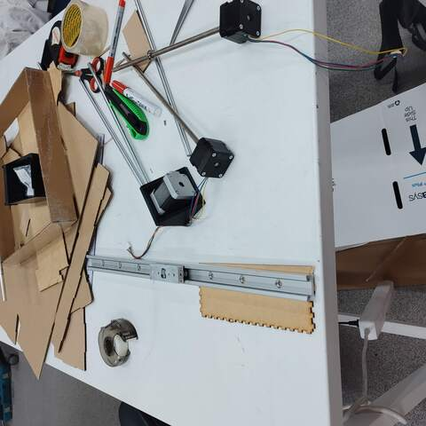
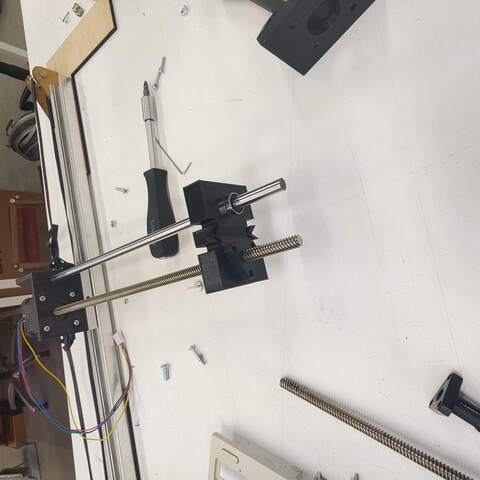
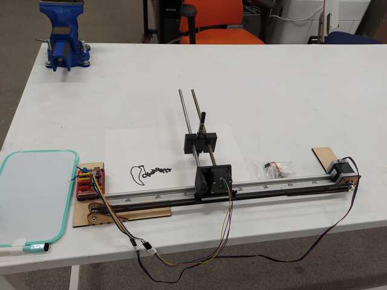

# 18 B. Mechanical Design (part 1 of 2) - group project 

> ## Assignment
>
> ### Group assignment
>
> - Design a machine that includes mechanism + actuation + automation
> - Build the mechanical parts and operate it manually.
> - Document the group project
>
> ### Individual assignment
>
> - Document your individual contribution.

## Group project documentation 

I did this work with Aleksi, but we both have our own documentation. You can choose whether you want to read Aleksi's documentation, my documentation or both. Both should contain the same things with small differences. 

- Antti's Documentation 
    - [18 A. Mechanical Design (part 1 of 2)](../week18/)
    - [18 B. Mechanical Design (part 1 of 2) - group project ](../week18_groupwork/)
    - [19 A. Machine Design (part 2 of 2)](../week19/)
    - [19 B. Machine Design (part 2 of 2) - group project ](../week19_groupwork/)

- Aleksi's Documentation 
    - [Week 18-19 assignments: Mechanical and machine design](https://almyllym.gitlab.io/FabLab-courses/week-assignment18.html)

## Project idea - Pen Plotter 

I did this group work with Aleksi. We chose the design and manufacture of a computer-controlled pen plotter as the topic of the group work. The idea for the group work was Aleksi and he had a bit of previous experience on the subject. 

It was decided to build the device so that in the X/Y-plane the drawing is controlled by two stepper motors, using the traditional mechanics where only the pen moves while the paper stays in place. To lift and lower the pen, the Z-axis uses either a stepper motor or a servomotor. 

Aleksi had a good and very suitable slide rail that it was decided to use as a base for the device. Other suitable parts were searched in Fab Lab and we found NEMA 17 stepper motors, sliding shafts and bearings. We couldn’t find a suitable stepper motor for lifting and lowering the pen so we decided to look into it later. 

||
||
|Finding and selecting suitable parts|

After finding the basic components, we started thinking about how to make the rest of the parts and divide the workload. It was my responsibility to design the mounting of the stepper motor on the slide rail and the mechanics of the pen control. Aleksi is responsible for the design of the stand, the attachment of the slide rail to the stand and the mechanics that move the slide rail using the stepper motor. Aleksi informs me of the dimensions of the slide rail transmission belt attachment so I can design it to the right size. 

## First prototype 

Here are a few pictures of the first prototype. The mechanics of the stepper motor mount and pen mount described above are made by me, the rest is designed and manufactured by Alex. 

||
||
|First proto mechanics|

||
||
|First proto tested|

## Bill of material 

|Quantity|Part                          |Supplier|
|        |                              |        |
|1       |slide rail                    |Aleksi  |
|1       |NEMA-17                       |Fab Lab |
|1       |NEMA-17 with threaded rod     |Fab Lab |
|1       |CD-ROM stepper motor          |Trash   |
|1       |8mm sliding shaft             |Fab Lab |
|2       |3mm sliding shaft             |Trash   |
|1       |shaft bearing                 |Fab Lab |
|1       |sprocket to motor end         |Fab Lab |
|1       |sprocket                      |Fab Lab |
|1       |belt 6mm wide                 |Fab Lab |
|1       |PLA                           |Fab Lab |
|1       |plywood                       |Fab Lab |
|-       |small parts                   |        |

## Files 

- Antti's Design
    - [PenPlotter.FCStd](../images/week18/PenPlotter.FCStd)
    - [PenPlotter.step](../images/week18/PenPlotter.step)
- Aleksi's Design
    - [rail.f3d](../images/week18/rail.f3d)
    - [rail.svg](../images/week18/rail.svg)
    - [servo.f3d](../images/week18/servo.f3d)
    - [servo.svg](../images/week18/servo.svg)

## Final thoughts 

.

