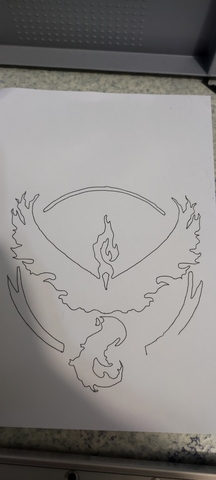

# 19 A. Machine Design (part 2 of 2) 

> ## Assignment
>
> ### Group assignment
>
> - Actuate and automate your machine.
> - Document the group project
>
> ### Individual assignment
>
> - Document your individual contribution.

## Group project documentation 

I did this work with Aleksi, but we both have our own documentation. You can choose whether you want to read Aleksi's documentation, my documentation or both. Both should contain the same things with small differences. 

- Antti's Documentation 
    - [18 A. Mechanical Design (part 1 of 2)](../week18/)
    - [18 B. Mechanical Design (part 1 of 2) - group project ](../week18_groupwork/)
    - [19 A. Machine Design (part 2 of 2)](../week19/)
    - [19 B. Machine Design (part 2 of 2) - group project ](../week19_groupwork/)

- Aleksi's Documentation 
    - [Week 18-19 assignments: Mechanical and machine design](https://almyllym.gitlab.io/FabLab-courses/week-assignment18.html)

## Pen Plotter functionality 

I don’t understand why this exercise is divided into two exercise tasks, Mechanical Design and Machine Design. In this part, which deals with the functionality of the device, I didn’t really have any individual work, or well - it has only been self-study of the techniques used. 

## Testing Pen Plotter 

I brought home the Pen Plotter we assembled in the Fab Lab because I wanted to learn more about the operation of its control logic. 

I decided to use the device to draw the same Valor logo that I have used in previous [weekly exercises](../week04/). I generated the toolpath (G-code) with the Gcodetools extension included in Inkscape. I used the same programs to control the device that were used in group work, that is, the device itself had Grbl software and the computer had ChiliPeppr Grbl-Workspace. 

||
||
|Pen Plotter in action|

||
||
|Pen Plotter drawn Valor Logo|

## Final thoughts 

This week I learned quite a bit of new stuff about the operation of stepper motors and especially how to control them. The topic is quite interesting and I would like to make my own CNC wood milling machine. Maybe I should change the current final project to design and manufacture a CNC milling machine. 

