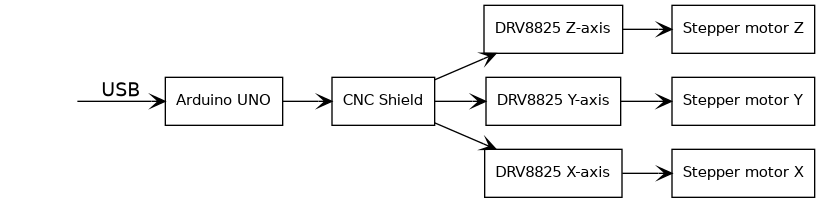
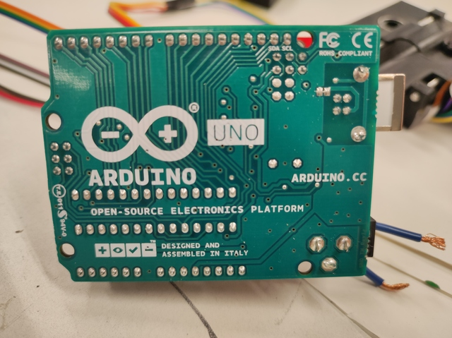
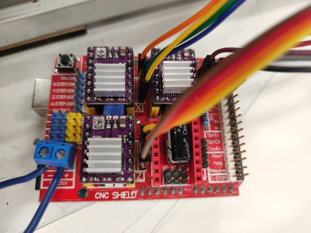
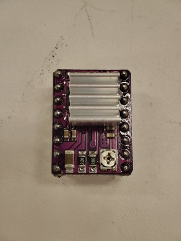
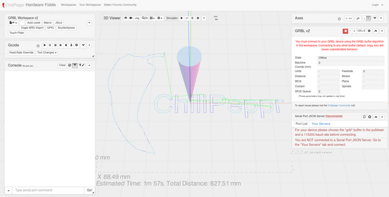
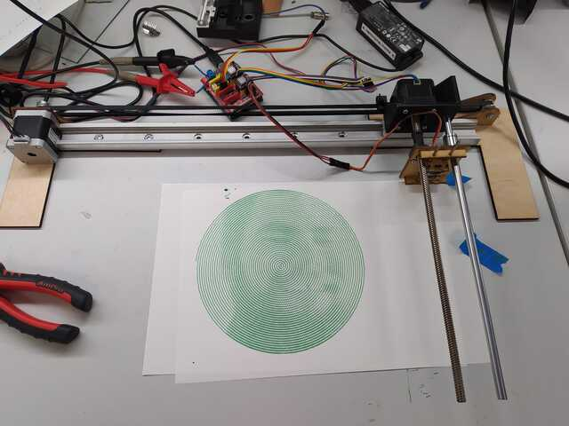
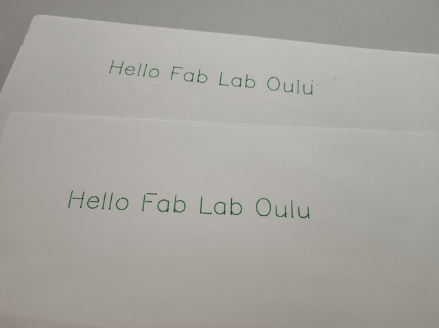

# 19 B. Machine Design (part 2 of 2) - group project 

> ## Assignment
>
> ### Group assignment
>
> - Actuate and automate your machine.
> - Document the group project
>
> ### Individual assignment
>
> - Document your individual contribution.

## Group project documentation 

I did this work with Aleksi, but we both have our own documentation. You can choose whether you want to read Aleksi's documentation, my documentation or both. Both should contain the same things with small differences. 

- Antti's Documentation 
    - [18 A. Mechanical Design (part 1 of 2)](../week18/)
    - [18 B. Mechanical Design (part 1 of 2) - group project ](../week18_groupwork/)
    - [19 A. Machine Design (part 2 of 2)](../week19/)
    - [19 B. Machine Design (part 2 of 2) - group project ](../week19_groupwork/)

- Aleksi's Documentation 
    - [Week 18-19 assignments: Mechanical and machine design](https://almyllym.gitlab.io/FabLab-courses/week-assignment18.html)

## Pen Plotter functionality 

### Hardware main logic 

||
||
|Hardware diagram|

Aleksi already had experience in controlling stepper motors and had the appropriate control electronics ready that we used. The stepper motors used in the device were controlled by an [Arduino UNO](http://store.arduino.cc/products/arduino-uno-rev3) board. CNC Shield was installed on the Arduino UNO board and we connected 3 DRV8825 stepper motor drivers to the CNC Shield - one for each stepper motor. Each stepper motor was connected with a four-wire cable to the stepper driver via the CNC Shield. The Arduino UNO board was connected to a computer with a USB cable. 

||
||
|Arduino UNO|

||
||
|Arduino CNC Shield|

### Stepper motor driver 

The stepper motor drivers we used were based on the [Texas Instruments DRV8825](https://www.ti.com/product/DRV8825) Stepper Motor Controller IC. That circuit supports a maximum of 1/32 microstepping. Since we had no problems with the speed of the stepper motors, we introduced the maximum 1/32 microstepping using the jumpers in the CNC Shield. Each stepper motor driver has a mechanical potentiometer for current limitation. We adjusted the current for each motor individually so that the maximum current was limited to just over what the motor required for normal operation. The small stepper motor taken from the CD-ROM drive overheated quite a bit which worried us a bit, but we estimate that the motor will withstand it. The 3D-printed pen lifting mechanism could move even lighter to further reduce motor power. 

||
||
|Stepper motor driver|

The stepper motors we used consumed many watts of power and we did not have a suitable power supply, so we used a lab power supply in our tests. The lab power supply also has the advantage that in the test phase it was possible to limit the current supplied and thus prevent equipment damage, for example in a case of a short circuit. 

### Device software 

||
||
|Software diagram|

The device logic comes from the [Grbl](https://github.com/grbl/grbl) software installed on the Arduino UNO. It is a fully-fledged software package that receives commands with Gcode and controls stepper motors based on it. The Arduino UNO is connected to a computer via a USB port, and the Grbl software installed on it provides a serial port over the USB bus from which the device's control commands, Gcodes, are given. We didn't have to implement our own logic at all, we just had to configure the settings used on the device in the Grbl software. The most important of the settings were, of course, the configurations of the stepper motors, such as how many steps are in one revolution and how fast any axis is moved. We sent movement commands to the device with Gcode and measured the physical movements. Based on them, we were able to calculate the settings correctly. 

The stepper motors we used were all typical 4-wire so-called bipolar motors. The order in which the wires were connected was a bit unclear, so we had to try several times before we found the correct wiring. This was helped by the fact that we knew how the motor winding was built so we could use a multimeter to measure which wire pairs belong to the same winding. 

### Device control application 

||
||
|ChiliPeppr Grbl-Workspace|

To control the device, we used the browser-based [ChiliPeppr](http://chilipeppr.com/) [Grbl-Workspace](http://chilipeppr.com/grbl). It provided a handy graphical user interface to control the device and also allowed you to manually enter Gcodes into the machine. The program receives the toolpaths as Gcodes and sends them to the Grbl program running in Arduino UNO. The program had some toolpaths with which we could test the operation of the device without having to generate our own drawings - which we also did. 

We had two different motorized pencil holders for the device. The other was made by Antti with a 3D printer and used a stepper motor taken from the CD-ROM drive. The other was made by Aleksi from a wood board by laser cutting and the mechanics were moved by a servomotor. We tested both and they work. The servomotor works differently than the stepper motor so its control had to be implemented differently, the control signal was taken directly from the Arduino UNO and bypassed the stepper motor control. 

## Test drawings 

||
||
|It is Aleksi :)|

||
||
|Upper with stepper motor, lower with servomotor|

## Bill of material 

|Quantity|Part                          |Supplier|
|        |                              |        |
|1       |Arduino Uno                   |Aleksi  |
|1       |Arduino CNC Shield v3         |Aleksi  |
|3       |DRV8825 Stepper Driver        |Fab Lab |

## References 

- [Wikipedia - Stepper motor](https://en.wikipedia.org/wiki/Stepper_motor)
- [Grbl](https://github.com/grbl/grbl)
- [Texas Instruments DRV8825](https://www.ti.com/product/DRV8825)
- [Arduino UNO Rev3](http://store.arduino.cc/products/arduino-uno-rev3)
- [Arduino CNC Shield](https://ooznest.co.uk/product/arduino-cnc-shield/)
- [ChiliPeppr](http://chilipeppr.com/)

## Files 

None.

## Final thoughts 

.

