# Final Project

## Weather station 

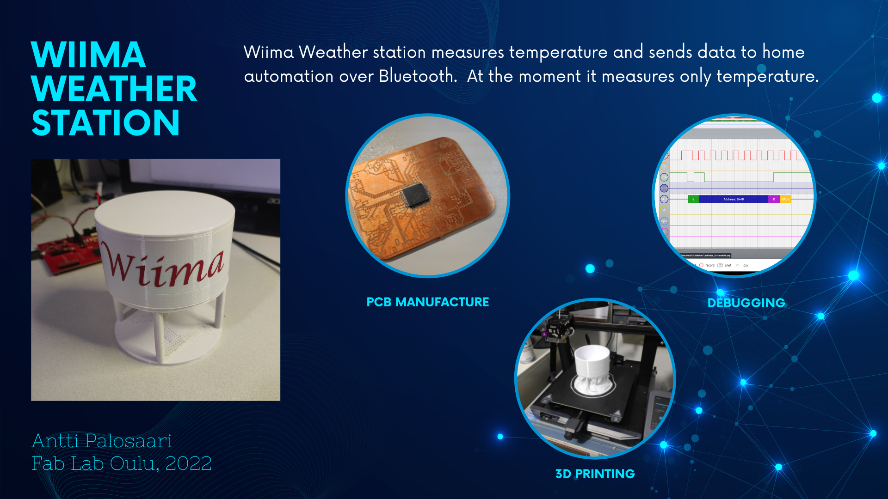


## Microcontroller board electronic design 

|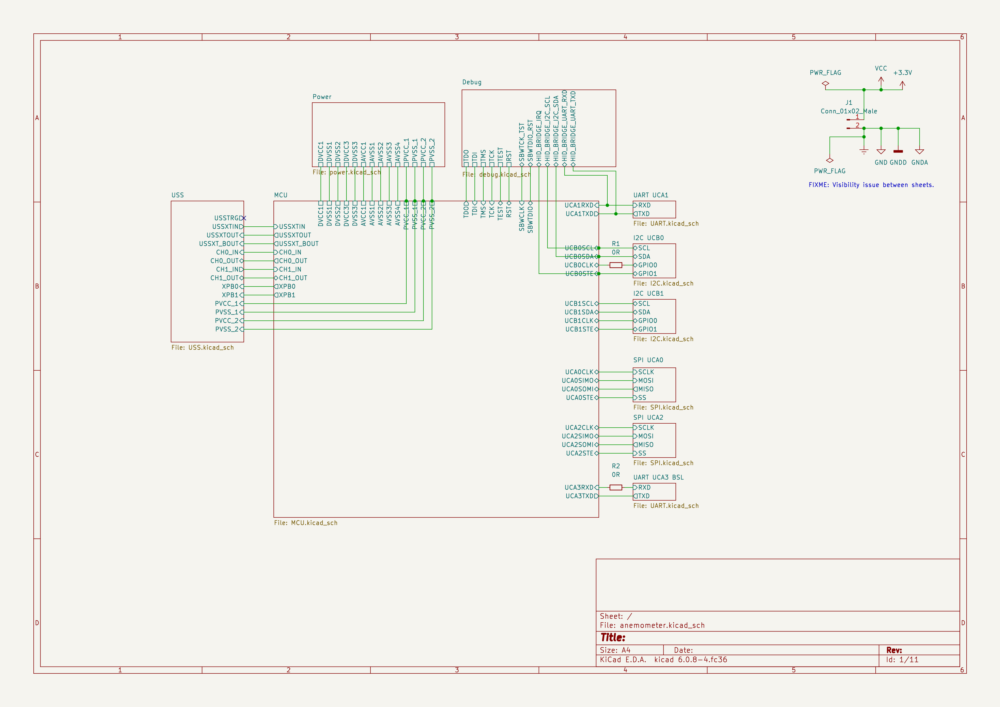|
||
|KiCAD main schematic|

I chose [Texas Instruments MSP430FR6043](https://www.ti.com/product/MSP430FR6043) as the microcontroller. The selection of the microcontroller was mainly influenced by the integrated digital ultrasonic frontend suitable for measuring gas flows. Another important reason was the extremely low power consumption, since the weather station often relies on battery-powered power supply. I had absolutely no previous experience with MSP430 family microcontrollers, which made designing the device very difficult. 

The microcontroller, the exact model MSP430FR6043IPN, was packed in an 80-pin LQFP case with a physical size of only 12mm x 12mm. There was no symbol for the component in KiCAD, so I downloaded a suitable one from the [Electronic Component Search Engine](https://componentsearchengine.com/) provided by SamacSys. The license is:

    1. There are no restrictions on the circuit board designs you make with our library components.
    2. You do not need to credit SamacSys in any way after using our Libraries.
    3. You will not distribute our models in any form usable as a PCB Library Component - except within your own company.

I interpret that point 3 of the license prohibits the distribution of the downloaded component together with the KiCAD project, so I do not distribute the KiCAD project. The matter needs to be clarified later and perhaps change the model of the component to another or define your own model. 

In the end, I managed to define my own MSP430FR6043IPN KiCAD symbol to get rid of the SamacSys license. It wasn't difficult, but it was quite time consuming as there was 80 pins on the chip. There was no need to define a footprint because KiCAD already had a suitable one. 

|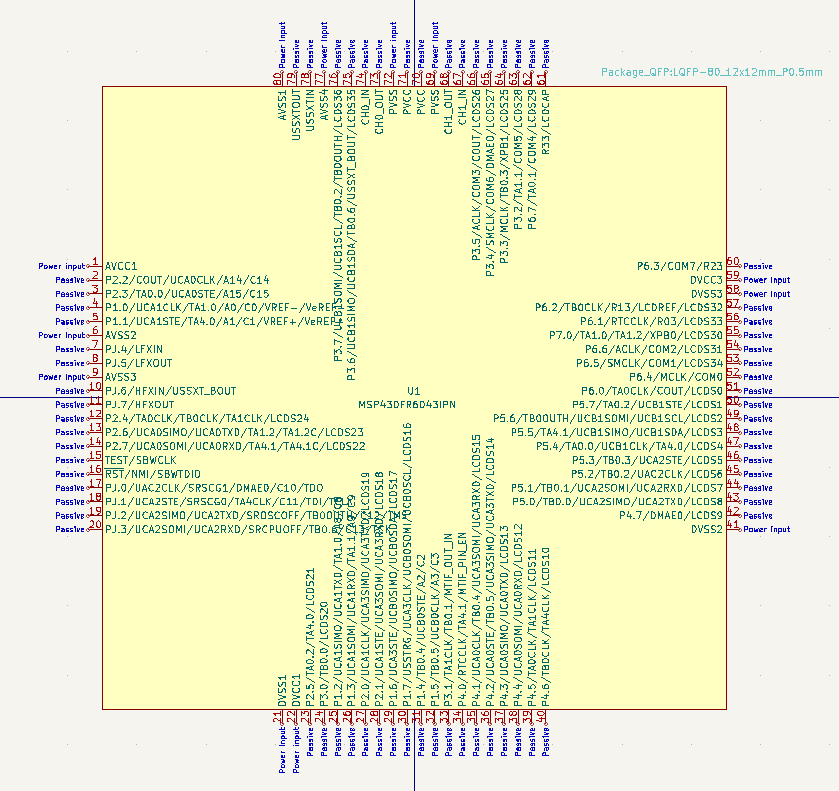|
||
|MSP430FR6043IPN symbol I defined|

- [Texas Instruments MSP430FR6043](https://www.ti.com/product/MSP430FR6043)

### Main design principles 

I designed the circuit around the MSP430FR6043 MCU using the following main points:

- No ultrasonic measurement. The ultrasonic measurement related pins on the microcontroller are routed to the connector for later development.
- No power supply, will add it later
- All possible I2C/SPI/UART buses are routed to connectors for connecting additional devices
- Programming interface Spy-Bi-Wire (serial JTAG)
- HID Bridge I2C interface for Ultrasonic Sensing Design Center application. That interface allows GUI application to communicate towards MCU and adjust various Ultrasonic specific configuration values.

|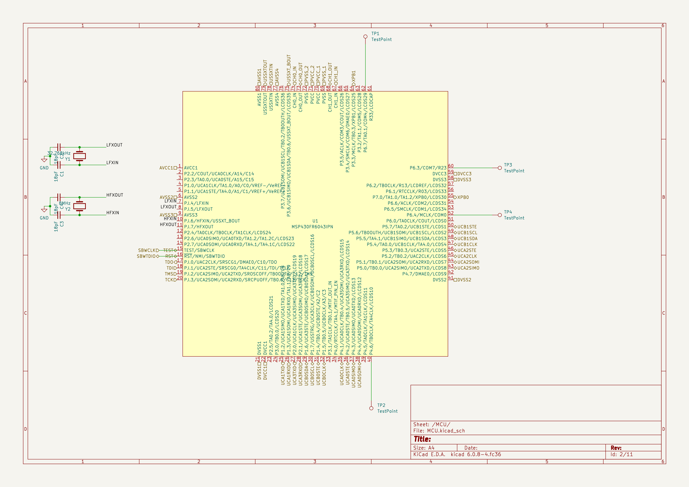|
||
||

### MCU power supply 

I installed filtering capacitors and resistors on all power supplies of the MCU according to the datasheet. The MCU had several completely separate power supplies, analog, digital and ultrasonic, which had to be separated from each other so that interference could not pass from one block of the circuit to another. However, I did not implement them, so there are probably losses in the sensitivity of the analog side. 

### Crystals 

Multiple clock sources can be used quite freely in the MCU. There are at least 3 external clock inputs, low frequency, high frequency and ultrasonic. I'm not even sure I need them all. However, I installed 2 crystals, low frequency crystal 32.768kHz and high frequency 8 MHz. I bought the crystals from a local electronics store and there were no datasheets for them, so I couldn't calculate the correct bypass capacitor values. I installed about 20pF capacitors. The crystals should be isolated in their own islands to avoid interference, but I didn't do that either.

### Programming interfaces 

As the programming connector, I chose a 20-pin connector that corresponds to the [Texas Instruments CAPTIVATE-PGMR](https://software-dl.ti.com/msp430/msp430_public_sw/mcu/msp430/CapTIvate_Design_Center/latest/exports/docs/users_guide/html/CapTIvate_Technology_Guide_html/markdown/ch_evm_CAPT_PGMR.html) programmer connector. I routed the Spy-Bi-Wire, HID-bridge I2C and HID-bridge UART lines to the connector. Such a big connector was a mistake and the next version will probably only have 2 pins for Spy-Bi-Wire (serial JTAG).

|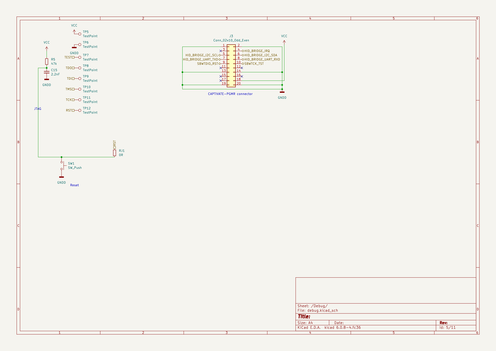|
||
|Debug connectors|

### SPI / I2C / UART ports 

The MCU has 6 ports that I routed all to connectors for connecting additional devices. The ports have some limitations, e.g. I2C was only available on UCB0 and UCB1 ports, so I enabled both of them as I2C. I divided the remaining ports equally between SPI and UART. I installed 10k ohm pull-up resistors on the I2C enabled ports. 

|eUSCI|mode|
|||
|UCA0|SPI|
|UCA1|UART|
|UCA2|SPI|
|UCA3|UART|
|UCB0|I2C|
|UCB1|I2C|

|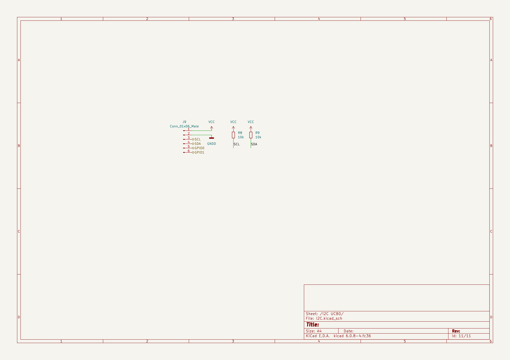|
||
|I2C port KiCAD schematic|

### Ultrasonic sensing interface 

I routed the pins related to the ultrasonic measurement to their own connector for later use. 

## Microcontroller board PCB 

### PCB design 

The physical size and shape of the device had to be taken into account when designing the circuit board. I tried to make the PCB as small as possible and slightly round in appearance.

I should also have taken into account the interference transfer between the circuit's analog and digital blocks and crystals, but I didn't.

I used a single-sided PCB, which was really difficult and a lot of work to design such a large schematic with KiCAD. I had to put in some 0 ohm jumper resistors because the wiring got crossed. Next time I will make a 2-sided PCB. 

|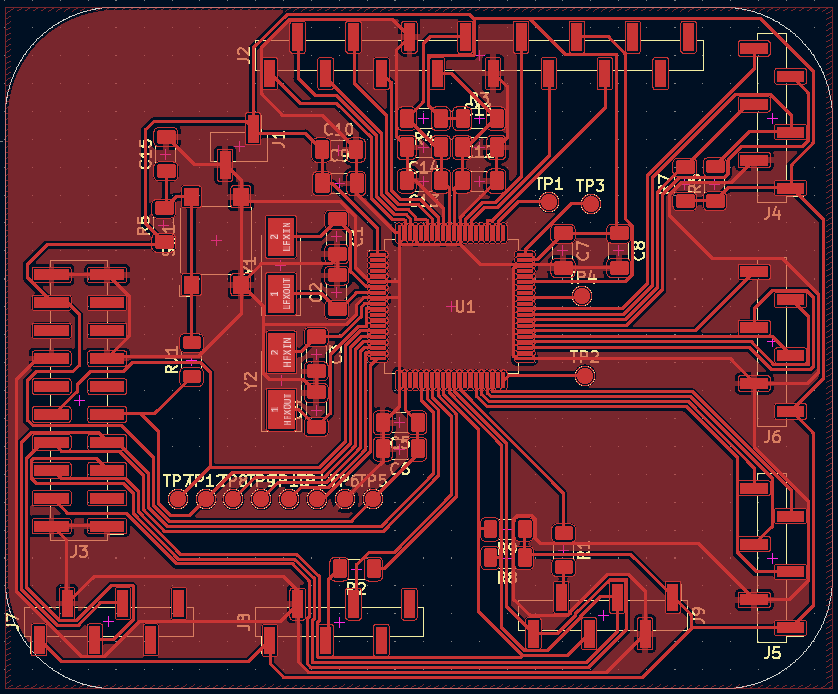|
||
|PCB KiCAD model|

### PCB manufacturing 

I made the PCB with the LPKF ProtoMat S62 milling machine, which I had already made some PCBs with in previous exercises.

|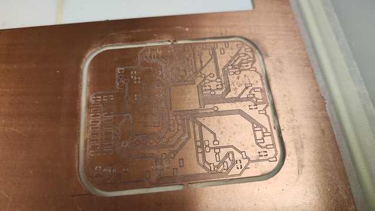|
||
|PCB milled|

### Soldering components 

I installed the 80-pin MCU using solder paste and baking in the oven. It didn't work out perfectly because the paste went too much in some places and caused short circuits. Some of the short circuits were in a difficult place behind the MCU pins, which were really difficult to fix by hand. I soldered the pins off, turned to the side and cut the foil that was short-circuited on the back side. I soldered the rest of the components by hand.

FabLab does not have a proper digital soldering microscope, which would be a great help when working with such small components. 

Not all component sizes could be found in FabLab, so I replaced them with the closest value. 

All in all, there were quite a few components on the circuit board. 

However, the circuit board worked right away and I didn't have to make a new one or make any changes to the original one. 

|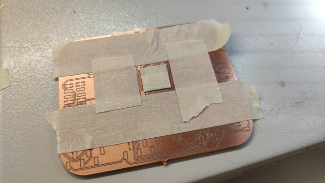|
||
|Poor paste mask|

|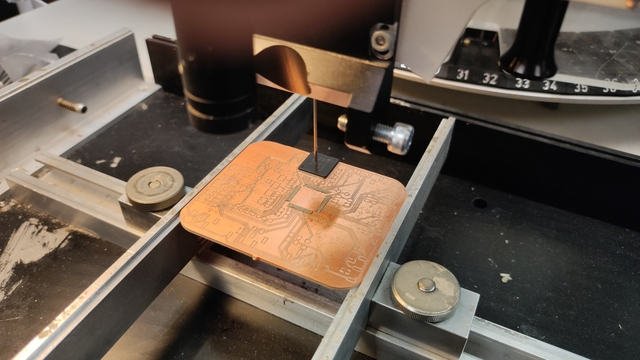|
||
|Attach MCU to paste|

|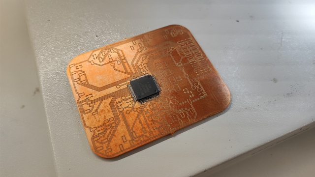|
||
|Baked PCB / MCU|

## Temperature sensor 

I thought I would use the [Bosch Sensortec BME280](https://www.bosch-sensortec.com/products/environmental-sensors/humidity-sensors-bme280/) 3-in-1, temperature, humidity and air pressure sensor. However, controlling the sensor seemed so complicated that it would have required a library and the schedule was tight, so I looked into other sensors that I happened to have. The register map of the [NXP LM75AD](https://www.nxp.com/part/LM75AD#/) temperature sensor looked very simple, you could read the temperature from it in the default mode with 9 bits with a resolution of 0.5 degrees. If you only read one byte, you got 8 uppermost bits, so the resolution drops from 0.5 degrees to one degree. That was enough for me for this exercise and I left out the least significant bit. 

The sensor I used was mounted on a ready-made circuit board of the "CJMCU-75" model. I soldered the jumpers on the board for I2C Address selection and soldered the pin header for the connections. I tried reading the sensor on the EVM430-FR6043 board with a small test program, but it didn't work despite several attempts. I have previously used these sensors with Tasmota firmware with the Wemos D1 mini Board, so I decided to try it again to see if they work. The sensor worked and I could read the temperature from the sensor. I tried to use a logic analyzer to see what kind of data is moving between the device and the sensor. However, there were problems here - every time the switch between the sensor of the logic analyzer and the microcontroller, the connection was lost. I concluded that the pull-up of the I2C bus is too weak and the extra load from the logic analyzer causes the bus to either go to zero or at least float randomly. I measured the CJMCU-75 board had 10k ohm pull-up resistors, which are perhaps a bit weak when around 5k are usually used. I soldered the extra 10k pull-up resistors directly to the I2C SDA and SCL legs of the board in order to boost the bus pull-up to 5k ohms. After that, the connection worked with the logic analyzer. With the logic analyzer I saw that I had used the wrong I2C address. In the end, I was able to read the temperature from the circuit with the EVM430-FR6043 development board and with my own designed board. 

|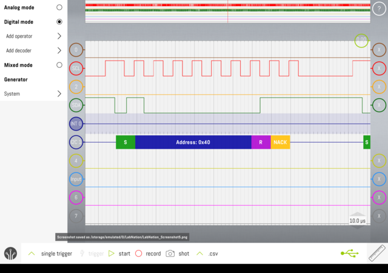|
||
|Logic analyzer, I2C|

|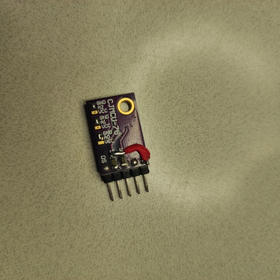|
||
|Extra pull-ups soldered|

|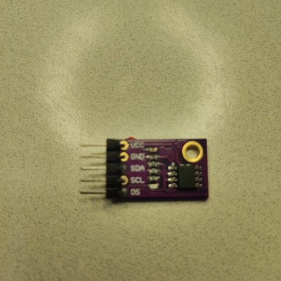|
||
||

- [NXP LM75AD](https://www.nxp.com/part/LM75AD#/)
- [Bosch Sensortec BME280](https://www.bosch-sensortec.com/products/environmental-sensors/humidity-sensors-bme280/)

## Bluetooth radio 

My goal is to send data from the weather station to home automation. The distance between the outdoor weather station and home automation is usually tens of meters, so the characteristics of the link radio become significant in the design criteria. Longer link intervals can be obtained with traditional 433MHz license-free radios and digital LoRa radio technology. Radio technologies suitable for shorter distances include e.g. ZigBee and Bluetooth. 

The Home Assistant automation system I use recently got native support for Bluetooth sensors, which gave one easy option for communication. FabLab had several different Bluetooth modules, so I ended up trying one that was [Microchip Technology RN4871](https://www.microchip.com/en-us/product/RN4871#). The module was interesting in that it had a UART as a control bus and commands could be given from the terminal, so I could relatively easily test completely new technology for myself. 

I made a simple circuit board according to the datasheet with the connection of the operating current and the UART. I tested the device I made by entering commands over the UART and looked at the data sent by the module with the [BLE Scanner (Connect & Notify)](https://play.google.com/store/apps/details?id=com.macdom.ble.blescanner) Android application. I already had a few indoor air condition meters that sent data to home automation according to the [BTHome](https://bthome.io/) protocol, so I studied the data they sent with the BLE Scanner (Connect & Notify) application and tried to get the RN4871 to send similar data. After researching and testing possible commands from the RN4871 module user's guide, I found the right 'IA' (advertisement) command to send a suitable data packet. After the correct packet was sent, Home Assistant Bluetooth autodiscovery found the new sensor and displayed the temperature. 

According to the protocol example on the BTHome website, the 25C temperature data is encoded as 0x1C18 2302C409. This same information can be sent with the RN4871 module by issuing the command: IA,16,1C182302C409 

- [Microchip Technology RN4871](https://www.microchip.com/en-us/product/RN4871#)
- [BTHome](https://bthome.io/)
- [BLE Scanner (Connect & Notify)](https://play.google.com/store/apps/details?id=com.macdom.ble.blescanner)

|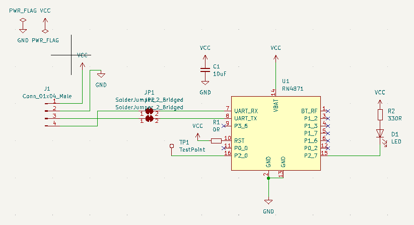|
||
|RN4871 KiCAD schematic|

|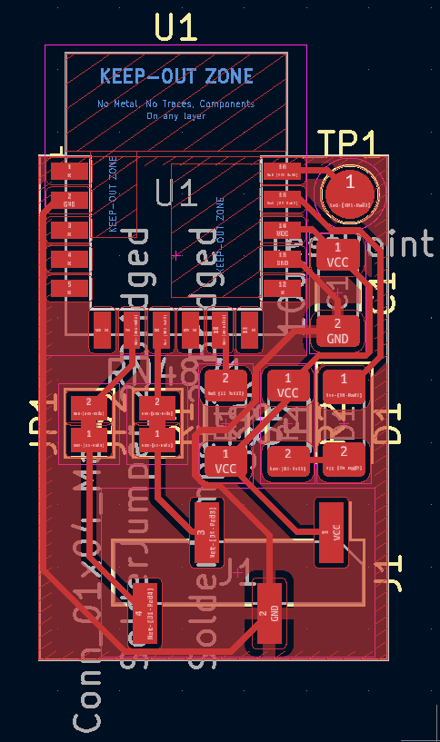|
||
|RN4871 KiCAD PCB|

|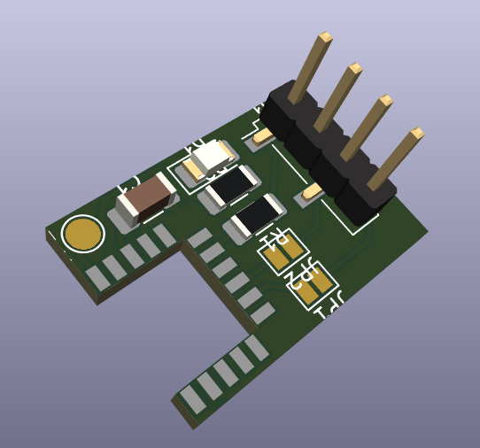|
||
|RN4871 KiCAD 3D model|

|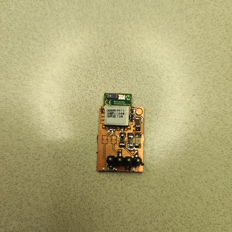|
||
||

|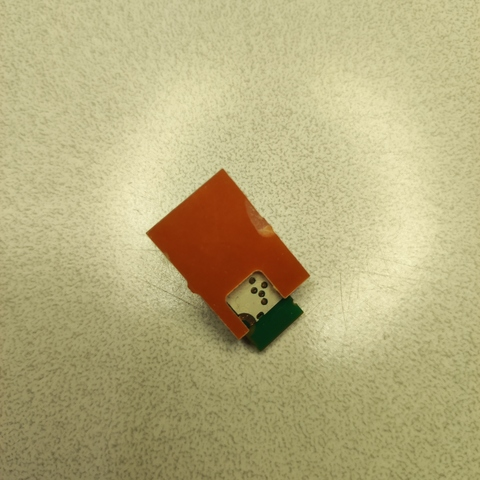|
||
||

|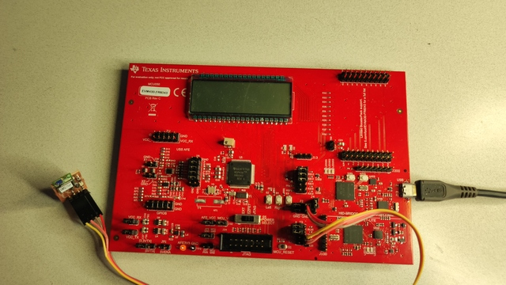|
||
|Testing Bluetooth module using EVM USB-UART|

## Software development 

### Toolchain 

I used [Texas Instruments CCSTUDIO](https://www.ti.com/tool/CCSTUDIO), Code Composer Studio, IDE for software development. It is a full-fledged development environment, including all the normal tools and a JTAG debugger as well. 

- [Texas Instruments CCSTUDIO](https://www.ti.com/tool/CCSTUDIO)

## MCU software 

I made a really simple program for the microcontroller that practically just reads the temperature sensor and sends the temperature data via Bluetooth in a loop. The temperature sensor is read on the I2C bus and the Bluetooth radio is on the UART bus. The program is made really stupidly and against all good habits by reading and writing UART and I2C port registers directly without using interrupts. I didn't use any specific libraries. 

``` c
#include <msp430.h>
#include <stdint.h>
#include <stdio.h>

int main(void)
{
    char uart_buf[40];
    int i, uart_buf_n;
    uint16_t temperature;

    WDTCTL = WDTPW | WDTHOLD;
    PM5CTL0 &= ~LOCKLPM5;

    // UART UCA3 9600
    // P2.0 UCA1TXD, P2.1 UCA1RXD (RX not used)
    UCA3CTLW0 |= UCSWRST;
    UCA3CTLW0 |= UCSSEL__SMCLK;     // clock source SMCLK
    UCA3BRW = 6;                    // baud rate 9600
    UCA3MCTLW |= 0x11 << 8 | UCBRF_8 | UCOS16;
    P2SEL0 &= ~BIT0;                // port function
    P2SEL1 |= BIT0;
    UCA3CTLW0 &= ~UCSWRST;

    // P1.6 UCB0SDA, P1.7 UCB0SCL
    UCB0CTLW0 |= UCSWRST;
    UCB0CTLW0 |= UCSSEL_3;          // clock source SMCLK
    UCB0BRW = 16;                   // I2C clock, SMCLK/16 = 62.5kHz
    UCB0CTLW0 |= UCMODE_3;          // port mode I2C
    UCB0CTLW0 |= UCMST;             // I2C mode master
    UCB0I2CSA = 0x48;               // LM75A I2C address
    UCB0CTLW1 |= UCASTP_2;          // I2C auto stop when read byte count reaches UCB0TBCNT
    UCB0TBCNT = 1;                  // I2C read count
    P1SEL1 |= BIT6;                 // port function
    P1SEL0 &= ~BIT6;
    P1SEL1 |= BIT7;
    P1SEL0 &= ~BIT7;
    UCB0CTLW0 &= ~UCSWRST;

    for (;;) {
        /*
         * Read temperature sensor
         * LM75A temperature sensor on I2C bus
         */

        __delay_cycles(1000000);
        UCB0CTLW0 |= UCTXSTT; // Start bit
        __delay_cycles(5000);

        // read I2C RX buffer
        temperature = UCB0RXBUF;

#if 1
        uart_buf_n = sprintf(uart_buf, "lm75 %d Celsius\r\n", temperature);
        for (i = 0; i < uart_buf_n; i++) {
            UCA3TXBUF = uart_buf[i];
            __delay_cycles(200000);
        }
#endif
        /*
         * Bluetooth beacon
         * Transmit temperature over Bluetooth
         * Microchip RN4871 Bluetooth module over UART
         *
         * BTHome Bluetooth Data Protocol
         * https://bthome.io/
         *
         * It should be read reply for each RN4871 command, but as we don't
         * lets wait a little bit and hope all is ok.
         */

        temperature = 100 * temperature;

        // Open command mode
        i = 0;
        uart_buf[i++] = '$';
        uart_buf[i++] = '$';
        uart_buf[i++] = '$';
        uart_buf[i++] = '\r';
        uart_buf[i++] = '\n';

        uart_buf_n = i;

        for (i = 0; i < uart_buf_n; i++) {
            UCA3TXBUF = uart_buf[i];
            __delay_cycles(200000);
        }
        __delay_cycles(1000000);

        // Clear advertisement
        i = 0;
        uart_buf[i++] = 'I';
        uart_buf[i++] = 'A';
        uart_buf[i++] = ',';
        uart_buf[i++] = 'Z';
        uart_buf[i++] = '\r';
        uart_buf[i++] = '\n';

        uart_buf_n = i;

        for (i = 0; i < uart_buf_n; i++) {
            UCA3TXBUF = uart_buf[i];
            __delay_cycles(200000);
        }
        __delay_cycles(1000000);


        // Set advertisement, BTHome API payload
        i = 0;
        uart_buf[i++] = 'I';
        uart_buf[i++] = 'A';
        uart_buf[i++] = ',';
        uart_buf[i++] = '1';
        uart_buf[i++] = '6';
        uart_buf[i++] = ',';
        uart_buf[i++] = '1';
        uart_buf[i++] = 'C';
        uart_buf[i++] = '1';
        uart_buf[i++] = '8';
        uart_buf[i++] = '2';
        uart_buf[i++] = '3';
        uart_buf[i++] = '0';
        uart_buf[i++] = '2';
        sprintf(&uart_buf[i++], "%x", ((temperature >>  4) & 0xf));
        sprintf(&uart_buf[i++], "%x", ((temperature >>  0) & 0xf));
        sprintf(&uart_buf[i++], "%x", ((temperature >> 12) & 0xf));
        sprintf(&uart_buf[i++], "%x", ((temperature >>  8) & 0xf));
        uart_buf[i++] = '\r';
        uart_buf[i++] = '\n';

        uart_buf_n = i;

        for (i = 0; i < uart_buf_n; i++) {
            UCA3TXBUF = uart_buf[i];
            __delay_cycles(200000);
        }
        __delay_cycles(1000000);

        // Close command mode
        i = 0;
        uart_buf[i++] = '-';
        uart_buf[i++] = '-';
        uart_buf[i++] = '-';
        uart_buf[i++] = '\r';
        uart_buf[i++] = '\n';

        uart_buf_n = i;

        for (i = 0; i < uart_buf_n; i++) {
            UCA3TXBUF = uart_buf[i];
            __delay_cycles(200000);
        }
        __delay_cycles(1000000);
    }
}
```

|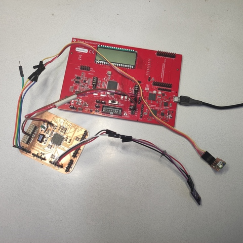|
||
|Test wiring|

## Home Assistant Bluetooth integration 

Home Assistant home automation recently got native [Bluetooth integration](https://www.home-assistant.io/integrations/bluetooth/). The automation recognizes the sensor automatically and gets it into the system with a couple of mouse clicks.

[BTHome](https://bthome.io/) is an open standard for broadcasting sensor data over Bluetooth LE. 

RN_BLE is the default Bluetooth name configured in the Microchip Technology RN4871 module. It can be changed easily. 

|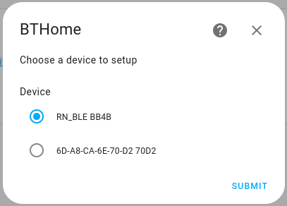|
||
|Home Assistant setup|

|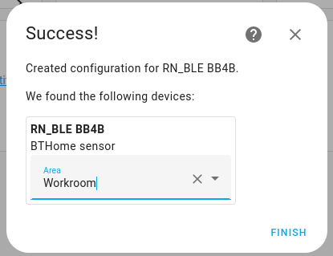|
||
|Home Assistant setup|

|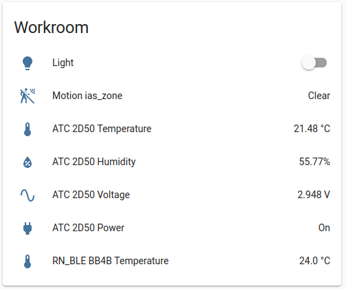|
||
|Home Assistant sensors in workroom|

The pictures show how the sensor resolution affects the data. The RN_BLE sensor uses 1C degree resolution and the ATC (Xiaomi) sensor uses 0.01C degree resolution. The Xiaomi sensor is here only as an example for comparison - it gives an idea of how the sensor should work when configured for a better resolution.

|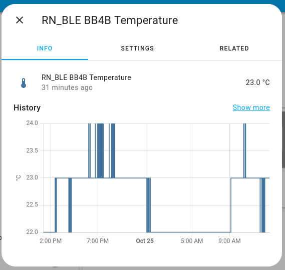|
||
|Home Assistant sensor data for the day|

|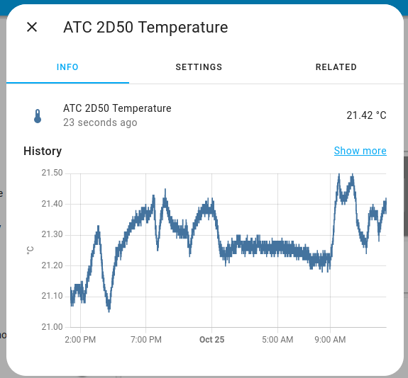|
||
|Home Assistant sensor data for the day - Xiaomi sensor|

## Case design 

|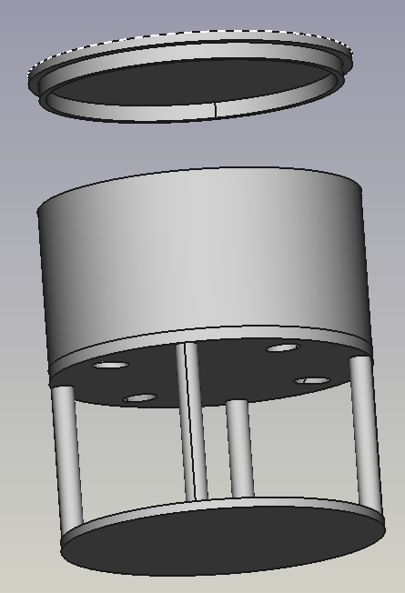|
||
|Case|

### Making the device case 

My intention is to make a weather station with an ultrasonic anemometer. I designed the case to be suitable for ultrasonic wind measurement so that I can use it to test the wind measurement later. For measuring temperature and humidity, the housing should have some kind of breathable structure that prevents direct sunlight from reaching the sensor in order to improve the quality of the measurement results. This structure is called a sunlight radiation shield.

### Radiation shield section 

The radiation shields used in weather stations usually always look roughly the same - a few disk-shaped plates are piled on top of each other so that the air flow gets to the sensor from between the plates. Radiation shields can be purchased separately, but if you want to integrate the entire weather station up to the anemometer, it may make sense to design and manufacture the entire housing yourself. I did not implement radiation protection at this stage.

### Wind tunnel section 

Two different constructions are usually used in ultrasonic anemometers. In a simpler model, the ultrasonic sensors are placed against each other and the sound travels directly from one sensor to another. In the second method, the ultrasound signal is reflected from one sensor to another through the surface. Local weather conditions, winter, snow, freezing, the latter structure would seem smarter because by placing the sensors on the ceiling and reflecting the signal from the floor, the sensors would be protected from the weather. I have bought 4 pcs of 200kHz ultrasound transducers, so I made places for them in the case for further development.

### Microcontroller housing section 

The design of the microcontroller housing is quite free. The only requirements are that the electronics must be protected from the weather and that the housing does not unnecessarily affect the operation of the weather sensors. In this case, I placed the electronics above the wind tunnel because it is easiest to connect the wires to the ultrasonic sensors. The current housing probably interferes with the wind measurement unnecessarily and it needs to be improved later.

### Modeling of the device housing 

I modeled the device case with FreeCAD. I made the holes for the ultrasonic transducers at an angle where the reflection takes place as directly as possible. Modeling the holes was the most difficult operation because the holes were not parallel to the coordinate axes of the model. I used the Datum Plane tool for each hole to define a suitable sloping surface. Maybe there is a smarter way to do this...

### Making the case 

The case is 3D printed in 2 parts - body and cover. I generated the toolpaths with Cura and printed with an Ender 3 S1 3D printer. I used tree support and the worst quality setting 0.28mm. Still, the printing time was so long that I had to stop and resume printing several times. The interruptions always left a small visible seam in the product.

|Part|Print time|Material amount|
||||
|Body|13h06min|129g|
|Cap|2h26min|28g|

The material was white PLA. Waterproof should be better taken into account in the device case for outdoor use. The case printed with PLA is probably too porous.


|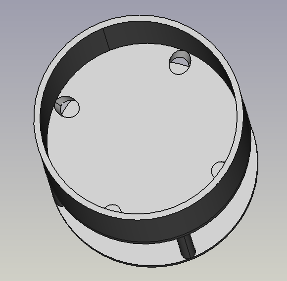|
||
|Case, body|

|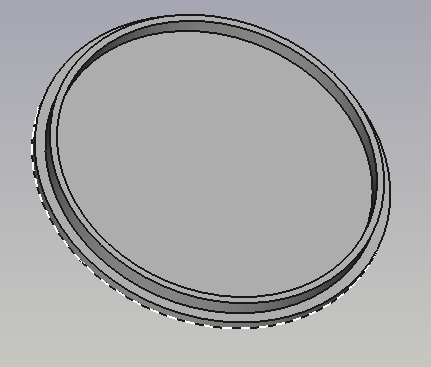|
||
|Case, cap|

|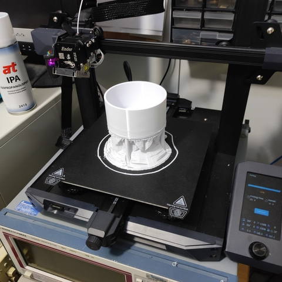|
||
|3D printing|

|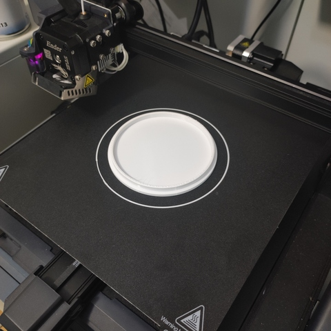|
||
|3D printing|

|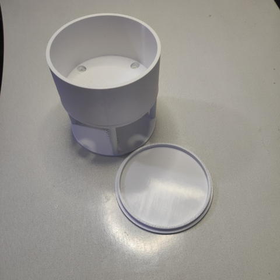|
||
||

|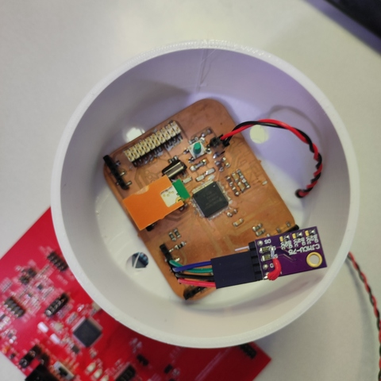|
||
||

|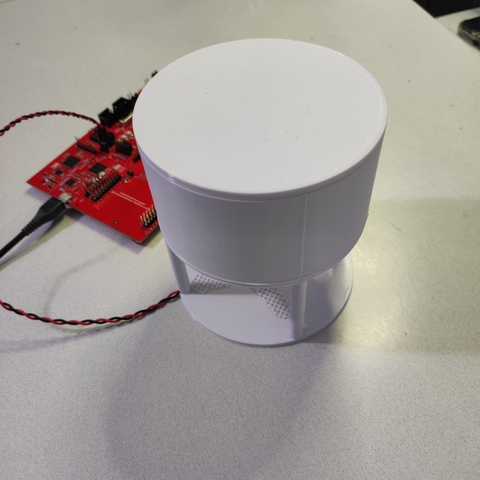|
||
||

### Making a sticker 

The exercise spec says:
> Your project should incorporate 2D and 3D design, additive and subtractive fabrication processes, electronics design and production, embedded microcontroller interfacing and programming, system integration and packaging.

In my opinion, PCB milling is "subtractive fabrication processes". However, the instructor of the course, Jani Ylioja, was of the opinion that manufacturing the circuit board by milling does not meet that requirement. So, to fulfill the requirements, I made a sticker with FabLab's computer-controlled vinyl cutter.

|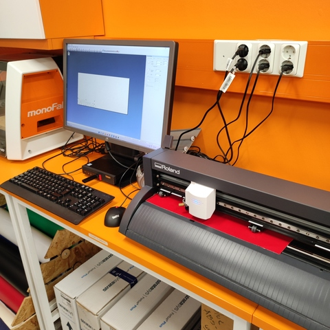|
||
|Roland CAMM-1 GS-24 vinyl cutter|

|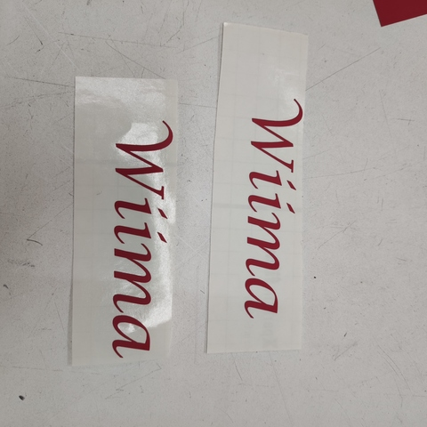|
||
|Stickers|

|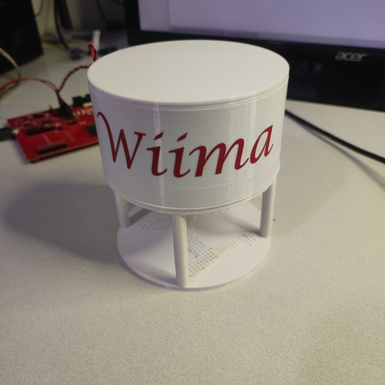|
||
|Enjoy!|

## Bill of material 

All the materials cost about 57e, excluding development tools.

As a special device, you also need a programming device for the microcontroller. There are several different types of programming devices. For that I bought [Texas Instruments EVM430-FR6043](https://www.ti.com/tool/EVM430-FR6043) which cost ~230e. 

- [Texas Instruments EVM430-FR6043](https://www.ti.com/tool/EVM430-FR6043)

### Main PCB 

The materials cost about 30e. 

|Qty|Reference(s)|Value|LibPart|
|||||
|4|C1, C2, C3, C4|18pF|Device:C_Small|
|3|C5, C7, C9|1u|pspice:C|
|3|C6, C8, C10|100n|pspice:C|
|2|C11, C13|22u|pspice:C|
|2|C12, C14|1n|pspice:C|
|1|C15|2.2nF|Device:C_Small|
|1|J1|Conn_01x02_Male|Connector:Conn_01x02_Male|
|1|J2|Conn_01x16_Male|Connector:Conn_01x16_Male|
|1|J3|Conn_02x10_Odd_Even|Connector_Generic:Conn_02x10_Odd_Even|
|6|J4, J5, J6, J7, J8, J9|Conn_01x06_Male|Connector:Conn_01x06_Male|
|3|R1, R2, RJ1|0R|Device:R_Small|
|2|R3, R4|22|Device:R|
|1|R5|47k|Device:R_Small|
|4|R6, R7, R8, R9|10k|Device:R_Small|
|1|SW1|SW_Push|Switch:SW_Push|
|1|U1|MSP430FR6043IPN|wiima:MSP430FR6043IPN|
|1|Y1|32.768kHz|Device:Crystal|
|1|Y2|8MHz|Device:Crystal|
|1|||PCB single sided 10x10cm|

### Bluetooth radio  

The materials cost about 20e. 

|Qty|Reference(s)|Value|LibPart|
|||||
|1|C1|10uF|Device:C_Small|
|1|D1|LED|Device:LED|
|1|J1|Conn_01x04_Male|Connector:Conn_01x04_Male|
|1|R1|0R|Device:R_Small|
|1|R2|330R|Device:R_Small|
|1|U1|RN4871|RF_Bluetooth:RN4871|
|1|||PCB single sided 3x3cm|

### Temperature sensor 

The materials cost about 2e. 

|Qty|Reference(s)|Value|LibPart|
|||||
|1||CJMCU-75||

### Case 

The materials cost about 5e. 

|Qty|Reference(s)|Value|LibPart|
|||||
|200g|||PLA filament|

## Licenses 

License for design CC0.

License for software MIT.

## References 

- [Texas Instruments MSP430FR6043](https://www.ti.com/product/MSP430FR6043)
- [Texas Instruments EVM430-FR6043](https://www.ti.com/tool/EVM430-FR6043)
- [NXP LM75AD](https://www.nxp.com/part/LM75AD#/)
- [Bosch Sensortec BME280](https://www.bosch-sensortec.com/products/environmental-sensors/humidity-sensors-bme280/)
- [Texas Instruments CCSTUDIO](https://www.ti.com/tool/CCSTUDIO)
- [Microchip Technology RN4871](https://www.microchip.com/en-us/product/RN4871#)
- [BTHome](https://bthome.io/)
- [BLE Scanner (Connect & Notify)](https://play.google.com/store/apps/details?id=com.macdom.ble.blescanner)


## Files 

- PCB
    - [anemometer.zip](./images/finalproject/anemometer.zip)
    - [RN4871_bluetooth.zip](./images/finalproject/RN4871_bluetooth.zip)
- Code
    - [main.c](./images/finalproject/main.c)
- Case
    - [FabWindy.FCStd](./images/finalproject/FabWindy.FCStd)
    - [FabWindy-Body.stl](./images/finalproject/FabWindy-Body.stl)
    - [FabWindy-Cap.stl](./images/finalproject/FabWindy-Cap.stl)
    - [Wiima_sticker.svg](./images/finalproject/Wiima_sticker.svg)

## Final thoughts 

It was supposed to be a weather station with an anemometer, but now it only measures temperature. 

Right from the beginning of the course, it was clear that building an ultrasonic anemometer is too big a job for this exercise. After the discussions at the beginning of the course, the features of the device were reduced with a heavy hand, keeping in mind that the device can later be added with features suitable for wind measurement as a spiral development. In practice, this was implemented using an MCU suitable for wind measurement. 

The lab didn't have MSP430 family MCUs at all, so I couldn't use them in the previous exercises, instead I used an ESP32 MCU. This increased the workload radically because I couldn't really use anything from the previous exercises. The MSP430 was a completely new platform for me. 

I will continue developing the section suitable for ultrasonic wind measurement after the course. The PCB has connections suitable for ultrasonic wind measurement, for which I will first try to build an additional board. Finally, a completely new version of the device will be made with better integration. 

